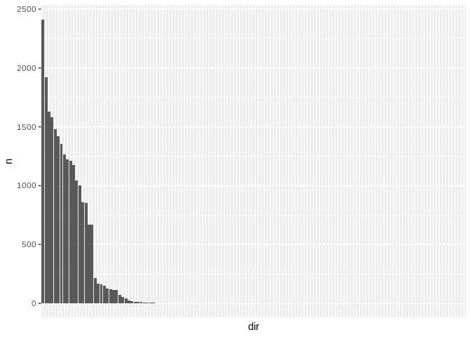

How many files per directory?
================
Steven Moran
10 December, 2021

``` r
library(tidyverse)
library(knitr)
library(ggplot2)
```

Get the file counts per
directory.

``` r
fils <- list.files("../../Corpus", pattern="txt$", full.names = TRUE, recursive = TRUE)
fils.counts <- tibble(dir = dirname(fils)) %>% count(dir) %>% arrange(desc(n))
```

There are this many directories:

``` r
nrow(fils.counts)
```

    ## [1] 138

There are this many files per directory:

``` r
kable(fils.counts)
```

| dir                                                       |    n |
| :-------------------------------------------------------- | ---: |
| ../../Corpus/Finnish\_fin/non-fiction/written             | 2413 |
| ../../Corpus/Turkish\_tur/non-fiction/written             | 1922 |
| ../../Corpus/Hebrew\_Modern\_heb/non-fiction/written      | 1630 |
| ../../Corpus/Russian\_rus/non-fiction/written             | 1581 |
| ../../Corpus/German\_deu/non-fiction/written              | 1478 |
| ../../Corpus/Greek\_Modern\_ell/non-fiction/written       | 1420 |
| ../../Corpus/Spanish\_spa/non-fiction/written             | 1355 |
| ../../Corpus/English\_eng/non-fiction/written             | 1266 |
| ../../Corpus/Indonesian\_ind/non-fiction/written          | 1226 |
| ../../Corpus/French\_fra/non-fiction/written              | 1211 |
| ../../Corpus/Persian\_pes/non-fiction/written             | 1173 |
| ../../Corpus/Japanese\_jpn/non-fiction/written            | 1042 |
| ../../Corpus/Thai\_tha/non-fiction/written                | 1001 |
| ../../Corpus/Vietnamese\_vie/non-fiction/written          |  859 |
| ../../Corpus/Korean\_kor/non-fiction/written              |  853 |
| ../../Corpus/Basque\_eus/non-fiction/written              |  669 |
| ../../Corpus/Mandarin\_cmn/non-fiction/written            |  667 |
| ../../Corpus/Georgian\_kat/non-fiction/written            |  217 |
| ../../Corpus/Greek\_Modern\_ell/fiction                   |  165 |
| ../../Corpus/Finnish\_fin/fiction                         |  161 |
| ../../Corpus/German\_deu/fiction                          |  152 |
| ../../Corpus/French\_fra/fiction                          |  126 |
| ../../Corpus/Spanish\_spa/fiction                         |  119 |
| ../../Corpus/English\_eng/fiction                         |  117 |
| ../../Corpus/Mandarin\_cmn/fiction                        |  115 |
| ../../Corpus/Hindi\_hin/non-fiction/written               |   72 |
| ../../Corpus/Tagalog\_tgl/fiction                         |   55 |
| ../../Corpus/Tagalog\_tgl/non-fiction/written             |   44 |
| ../../Corpus/Japanese\_jpn/fiction                        |   25 |
| ../../Corpus/Piraha\_myp/conversation                     |   17 |
| ../../Corpus/Warao\_wba/non-fiction/spoken                |   15 |
| ../../Corpus/Ngiyambaa\_wyb/conversation                  |   11 |
| ../../Corpus/Tiwi\_tiw/non-fiction/spoken                 |   10 |
| ../../Corpus/Martuthunira\_vma/conversation               |    7 |
| ../../Corpus/Hebrew\_Modern\_heb/fiction                  |    5 |
| ../../Corpus/Ngiyambaa\_wyb/non-fiction/spoken            |    5 |
| ../../Corpus/Russian\_rus/fiction                         |    4 |
| ../../Corpus/Gooniyandi\_gni/conversation                 |    3 |
| ../../Corpus/Makah\_myh/conversation                      |    3 |
| ../../Corpus/Rapanui\_rap/non-fiction/spoken              |    3 |
| ../../Corpus/Asmat\_tml/conversation                      |    2 |
| ../../Corpus/Greek\_Modern\_ell/professional              |    2 |
| ../../Corpus/Hausa\_hau/professional                      |    2 |
| ../../Corpus/Lavukaleve\_lvk/non-fiction/spoken           |    2 |
| ../../Corpus/Makah\_myh/non-fiction/spoken                |    2 |
| ../../Corpus/Mandarin\_cmn/professional                   |    2 |
| ../../Corpus/Otomi\_Mezquital\_ote/non-fiction/written    |    2 |
| ../../Corpus/Paiwan\_pwn/conversation                     |    2 |
| ../../Corpus/Swahili\_swh/non-fiction/written             |    2 |
| ../../Corpus/Vietnamese\_vie/professional                 |    2 |
| ../../Corpus/Wari\_pav/conversation                       |    2 |
| ../../Corpus/Wichita\_wic/conversation                    |    2 |
| ../../Corpus/Abkhaz\_abk/professional                     |    1 |
| ../../Corpus/Acoma\_kjq/non-fiction/spoken                |    1 |
| ../../Corpus/Alamblak\_amp/non-fiction/written            |    1 |
| ../../Corpus/Amele\_aey/non-fiction/written               |    1 |
| ../../Corpus/Apurina\_apu/non-fiction/written             |    1 |
| ../../Corpus/Arabic\_Egyptian\_arz/non-fiction/written    |    1 |
| ../../Corpus/Arapesh\_Mountain\_ape/non-fiction/written   |    1 |
| ../../Corpus/Bagirmi\_bmi/grammar/spoken                  |    1 |
| ../../Corpus/Barasano\_bsn/non-fiction/written            |    1 |
| ../../Corpus/Basque\_eus/professional                     |    1 |
| ../../Corpus/Berber\_MiddleAtlas\_tzm/professional        |    1 |
| ../../Corpus/Burmese\_mya/non-fiction/written             |    1 |
| ../../Corpus/Burmese\_mya/professional                    |    1 |
| ../../Corpus/Burushaski\_bsk/grammar/spoken               |    1 |
| ../../Corpus/CanelaKraho\_ram/non-fiction/written         |    1 |
| ../../Corpus/Chamorro\_cha/non-fiction/written            |    1 |
| ../../Corpus/Chamorro\_cha/professional                   |    1 |
| ../../Corpus/Chukchi\_ckt/non-fiction/written             |    1 |
| ../../Corpus/Cree\_Plains\_crk/non-fiction/spoken         |    1 |
| ../../Corpus/Daga\_dgz/non-fiction/written                |    1 |
| ../../Corpus/Dani\_LowerGrandValley\_dni/conversation     |    1 |
| ../../Corpus/English\_eng/professional                    |    1 |
| ../../Corpus/Fijian\_fij/non-fiction/written              |    1 |
| ../../Corpus/Fijian\_fij/professional                     |    1 |
| ../../Corpus/Finnish\_fin/professional                    |    1 |
| ../../Corpus/French\_fra/professional                     |    1 |
| ../../Corpus/Georgian\_kat/professional                   |    1 |
| ../../Corpus/German\_deu/professional                     |    1 |
| ../../Corpus/Grebo\_gry/non-fiction/spoken                |    1 |
| ../../Corpus/Greenlandic\_West\_kal/non-fiction/written   |    1 |
| ../../Corpus/Greenlandic\_West\_kal/professional          |    1 |
| ../../Corpus/Guarani\_gug/non-fiction/written             |    1 |
| ../../Corpus/Guarani\_gug/professional                    |    1 |
| ../../Corpus/Hausa\_hau/non-fiction/written               |    1 |
| ../../Corpus/Hebrew\_Modern\_heb/professional             |    1 |
| ../../Corpus/Hindi\_hin/professional                      |    1 |
| ../../Corpus/Hixkaryana\_hix/non-fiction/written          |    1 |
| ../../Corpus/HmongNjua\_hnj/professional                  |    1 |
| ../../Corpus/Imonda\_imn/non-fiction/spoken               |    1 |
| ../../Corpus/Indonesian\_ind/professional                 |    1 |
| ../../Corpus/Jakaltek\_jac/non-fiction/written            |    1 |
| ../../Corpus/Japanese\_jpn/professional                   |    1 |
| ../../Corpus/Kannada\_kan/professional                    |    1 |
| ../../Corpus/Kayardild\_gyd/grammar/spoken                |    1 |
| ../../Corpus/Kewa\_kew/non-fiction/written                |    1 |
| ../../Corpus/Khalkha\_khk/non-fiction/written             |    1 |
| ../../Corpus/Khalkha\_khk/professional                    |    1 |
| ../../Corpus/Khoekhoe\_naq/non-fiction/written            |    1 |
| ../../Corpus/Kiowa\_kio/non-fiction/spoken                |    1 |
| ../../Corpus/Korean\_kor/professional                     |    1 |
| ../../Corpus/Kutenai\_kut/non-fiction/spoken              |    1 |
| ../../Corpus/Lango\_laj/non-fiction/written               |    1 |
| ../../Corpus/Luvale\_lue/professional                     |    1 |
| ../../Corpus/Malagasy\_plt/non-fiction/written            |    1 |
| ../../Corpus/Malagasy\_plt/professional                   |    1 |
| ../../Corpus/Mapudungun\_arn/non-fiction/written          |    1 |
| ../../Corpus/Mapudungun\_arn/professional                 |    1 |
| ../../Corpus/Maung\_mph/non-fiction/written               |    1 |
| ../../Corpus/Maybrat\_ayz/non-fiction/written             |    1 |
| ../../Corpus/Mixtec\_Chalcatongo\_mig/non-fiction/written |    1 |
| ../../Corpus/Oromo\_Harar\_hae/non-fiction/written        |    1 |
| ../../Corpus/Otomi\_Mezquital\_ote/grammar/written        |    1 |
| ../../Corpus/Otomi\_Mezquital\_ote/professional           |    1 |
| ../../Corpus/Paiwan\_pwn/non-fiction/spoken               |    1 |
| ../../Corpus/Persian\_pes/fiction                         |    1 |
| ../../Corpus/Persian\_pes/professional                    |    1 |
| ../../Corpus/Quechua\_Imbabura\_qvi/non-fiction/written   |    1 |
| ../../Corpus/Rama\_rma/grammar/spoken                     |    1 |
| ../../Corpus/Rama\_rma/non-fiction/spoken                 |    1 |
| ../../Corpus/Russian\_rus/professional                    |    1 |
| ../../Corpus/Sango\_sag/non-fiction/written               |    1 |
| ../../Corpus/Sango\_sag/professional                      |    1 |
| ../../Corpus/Sanuma\_xsu/non-fiction/written              |    1 |
| ../../Corpus/Spanish\_spa/professional                    |    1 |
| ../../Corpus/Swahili\_swh/professional                    |    1 |
| ../../Corpus/Tagalog\_tgl/professional                    |    1 |
| ../../Corpus/Thai\_tha/professional                       |    1 |
| ../../Corpus/Turkish\_tur/professional                    |    1 |
| ../../Corpus/Wichi\_mzh/non-fiction/written               |    1 |
| ../../Corpus/Yagua\_yad/non-fiction/written               |    1 |
| ../../Corpus/Yagua\_yad/professional                      |    1 |
| ../../Corpus/Yaqui\_yaq/non-fiction/written               |    1 |
| ../../Corpus/Yoruba\_yor/non-fiction/written              |    1 |
| ../../Corpus/Yoruba\_yor/professional                     |    1 |
| ../../Corpus/Zoque\_Copainala\_zoc/non-fiction/spoken     |    1 |
| ../../Corpus/Zulu\_zul/professional                       |    1 |

Plot the distrubtion of file counts.

``` r
# Order the data frame so that it plots correctly on the y-axis
fils.counts$dir <- factor(fils.counts$dir, levels = fils.counts$dir)

# Plot the distribution
ggplot(data=fils.counts, aes(x=dir, y=n)) + geom_bar(stat="identity") +
  theme(axis.text.x=element_blank(),
        axis.ticks.x=element_blank())
```

<!-- -->
