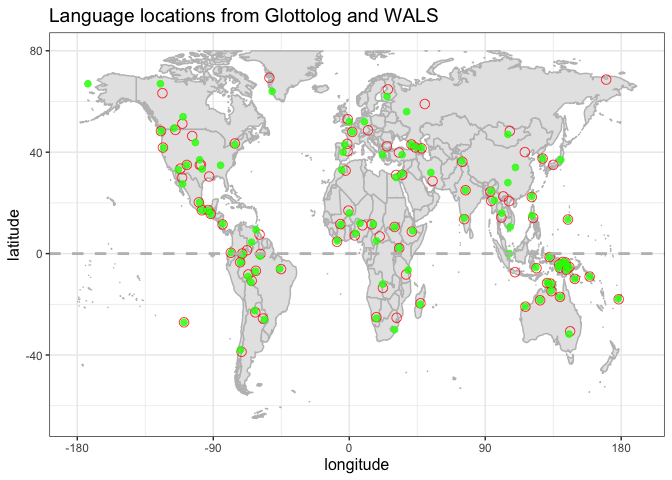
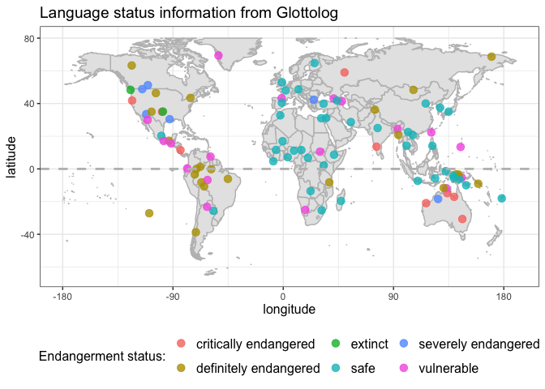
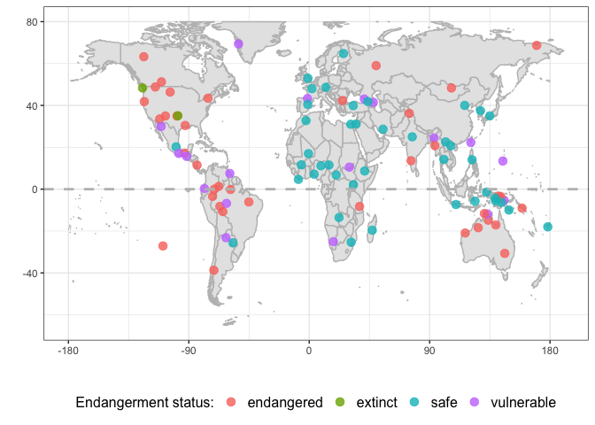
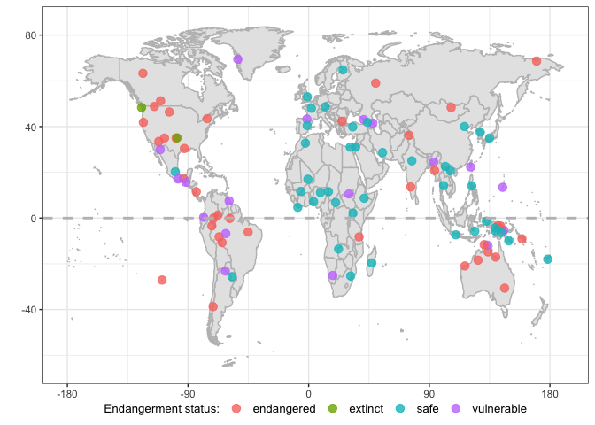
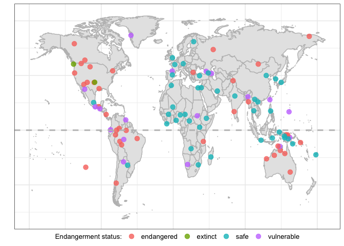
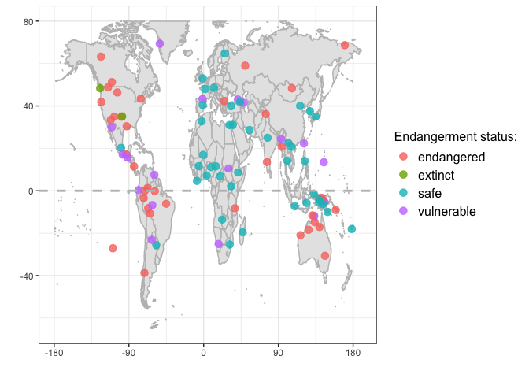
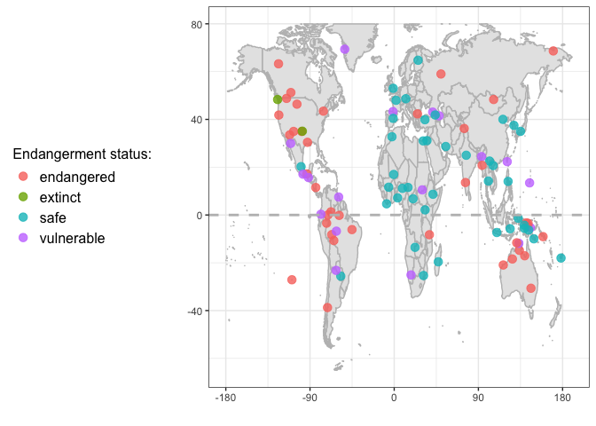
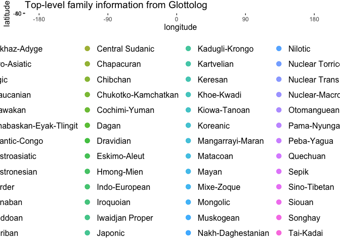
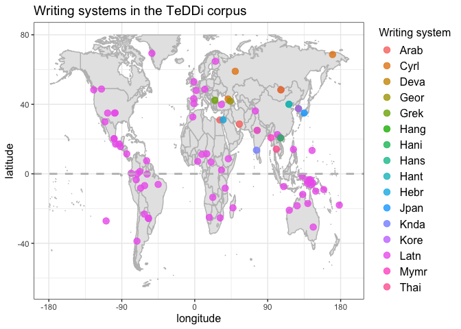
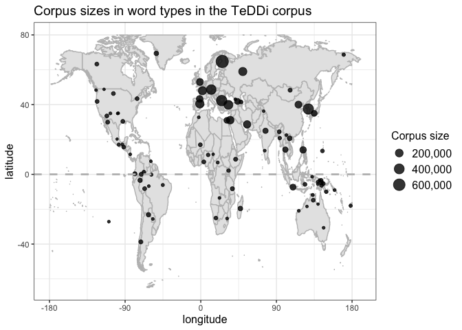

Generate world maps from the TeDDi language sample
================
Steven Moran and Chris Bentz
22 April, 2022

``` r
library(tidyverse)
library(ggmap)
library(maps)
library(testthat)
```

# Overview

Let’s generate some world maps from the TeDDi language sample for visual
inspection and for publications. If you want to save them as PDF,
uncomment the last line in each map plot, i.e. `ggsave`.

Load the lang info file with information on TeDDi language sample.

``` r
lang_teddi <- read.csv("../../LangInfo/langInfo_TeDDi.csv", header = T)
```

Some data checks. All rows should have a unique ISO 639-3 code and a
Glottocode. Other values are set at the time of reporting.

``` r
expect_equal(length(unique(lang_teddi$iso639_3)), 100)
expect_equal(length(unique(lang_teddi$glottocode)), 100)
expect_equal(length(unique(lang_teddi$top_level_family)), 61)
expect_equal(length(unique(lang_teddi$genus_wals)), 94)
expect_equal(length(unique(lang_teddi$family_wals)), 68)
expect_equal(length(unique(lang_teddi$macroarea_glotto)), 6)
```

A world map with language locations from
[Glottolog](https://glottolog.org/) and [WALS](https://wals.info/).

``` r
world <- map_data("world")
lang_teddi_map <- ggplot() +
  geom_polygon(data = world, aes(x = long, y = lat, group = group), 
               fill = "grey90", col = "grey") +
  geom_point(data = lang_teddi, aes(x = longitude_glotto, y = latitude_glotto),
             colour = "red", alpha = 0.8, size = 3, shape = 1) +
  geom_point(data = lang_teddi, aes(x = longitude_wals, y = latitude_wals),
             colour = "green", alpha = 0.8, size = 2) +
  scale_y_continuous(limits = c(-65, 80)) +
  scale_x_continuous(breaks = c(-180, -90, 0, 90, 180)) +
  geom_hline(aes(yintercept = 0), colour = "grey", size = 1, linetype = 2) +
  labs(x = "longitude", y = "latitude") +
  ggtitle("Language locations from Glottolog and WALS") +
  theme_bw() +
  theme(axis.title.x = element_text(size = 12),
        axis.title.y = element_text(size = 12),
        title=element_text(size = 12),
        legend.title = element_text(size = 10),
        legend.position = "bottom")
lang_teddi_map
```

<!-- -->

``` r
# ggsave("lang_teddi_map.pdf", status_map, dpi = 300, scale = 1, device = cairo_pdf)
```

A world map with language status information from Glottolog.

``` r
world <- map_data("world")
status_map <- ggplot() + 
  geom_polygon(data = world, aes(x = long, y = lat, group = group), 
               fill = "grey90", col = "grey") +
  geom_point(data = lang_teddi, aes(x = longitude_glotto, y = latitude_glotto, colour = status),
             alpha = 0.8, size = 3) +
  scale_y_continuous(limits = c(-65, 80)) +
  scale_x_continuous(breaks = c(-180, -90, 0, 90, 180)) +
  geom_hline(aes(yintercept = 0), colour = "grey", size = 1, linetype = 2) +
  labs(x = "longitude", y = "latitude", color = "Endangerment status:") +
  ggtitle("Language status information from Glottolog") +
  theme_bw() +
  theme(axis.title.x = element_text(size = 12),
        axis.title.y = element_text(size = 12),
        title = element_text(size = 12),
        legend.title = element_text(size = 12),
        legend.text = element_text(size = 12),
        legend.position = "bottom")
status_map
```

<!-- -->

``` r
# ggsave("worldmap_status.pdf", status_map, dpi = 300, scale = 1, device = cairo_pdf)
```

For publication, we tweak the labels.

``` r
world <- map_data("world")
status_map <- ggplot() + 
  geom_polygon(data = world, aes(x = long, y = lat, group = group), 
               fill = "grey90", col = "grey") +
  geom_point(data = lang_teddi, aes(x = longitude_glotto, y = latitude_glotto, colour = status),
             alpha = 0.8, size = 3) +
  scale_y_continuous(limits = c(-65, 80)) +
  scale_x_continuous(breaks = c(-180, -90, 0, 90, 180)) +
  geom_hline(aes(yintercept = 0), colour = "grey", size = 1, linetype = 2) +
  labs(x = "", y = "", color = "Endangerment status:") +
  theme_bw() +
  theme(axis.title.x = element_text(size = 12),
        axis.title.y = element_text(size = 12),
        title = element_text(size = 12),
        legend.title = element_text(size = 12),
        legend.text = element_text(size = 12),
        legend.position = "bottom")
status_map
```

<!-- -->

``` r
# ggsave("worldmap_status.pdf", status_map, dpi = 300, scale = 1, device = cairo_pdf)
```

We can also tweak the EL scales, so that the legend isn’t so large. We
consider all ELs EL.

``` r
minimal_el_status <- lang_teddi
minimal_el_status$status[minimal_el_status$status == "severely endangered"] <- "endangered"
minimal_el_status$status[minimal_el_status$status == "definitely endangered"] <- "endangered"
minimal_el_status$status[minimal_el_status$status == "critically endangered"] <- "endangered"
```

Map it.

``` r
world <- map_data("world")
status_map <- ggplot() + 
  geom_polygon(data = world, aes(x = long, y = lat, group = group), 
               fill = "grey90", col = "grey") +
  geom_point(data = minimal_el_status, aes(x = longitude_glotto, y = latitude_glotto, colour = status), 
             alpha = 0.8, size = 3) +
  scale_y_continuous(limits = c(-65, 80)) +
  scale_x_continuous(breaks = c(-180, -90, 0, 90, 180)) +
  geom_hline(aes(yintercept = 0), colour = "grey", size = 1, linetype = 2) +
  labs(x = "", y = "", color = "Endangerment status:") +
  theme_bw() +
  theme(axis.title.x = element_text(size = 12),
        axis.title.y = element_text(size = 12),
        title = element_text(size = 12),
        legend.title = element_text(size = 12),
        legend.text = element_text(size = 12),
        legend.position = "bottom")
status_map
```

<!-- -->

``` r
# ggsave("worldmap_status.pdf", status_map, dpi = 300, scale = 1, device = cairo_pdf)
```

Map it with smaller text and closer legend.

``` r
world <- map_data("world")
status_map <- ggplot() + 
  geom_polygon(data = world, aes(x = long, y = lat, group = group), 
               fill = "grey90", col = "grey") +
  geom_point(data = minimal_el_status, aes(x = longitude_glotto, y = latitude_glotto, colour = status), 
             alpha = 0.8, size = 3) +
  scale_y_continuous(limits = c(-65, 85)) +
  scale_x_continuous(breaks = c(-180, -90, 0, 90, 180)) +
  geom_hline(aes(yintercept = 0), colour = "grey", size = 1, linetype = 2) +
  labs(x = "", y = "", color = "Endangerment status:") +
  theme_bw() +
  theme(legend.title = element_text(size = 10),
        legend.text = element_text(size = 10),
        legend.position = "bottom",
        legend.margin=margin(0,0,0,0),
        legend.box.margin=margin(-25,0,0,0))
status_map
```

<!-- -->

``` r
# ggsave("worldmap_status.pdf", status_map, dpi = 300, scale = 1, device = cairo_pdf)
```

Map it with smaller text and closer legend and remove axes.

``` r
world <- map_data("world")
status_map <- ggplot() + 
  geom_polygon(data = world, aes(x = long, y = lat, group = group), 
               fill = "grey90", col = "grey") +
  geom_point(data = minimal_el_status, aes(x = longitude_glotto, y = latitude_glotto, colour = status), 
             alpha = 0.8, size = 3) +
  scale_y_continuous(limits = c(-65, 85)) +
  scale_x_continuous(breaks = c(-180, -90, 0, 90, 180)) +
  geom_hline(aes(yintercept = 0), colour = "grey", size = 1, linetype = 2) +
  labs(x = "", y = "", color = "Endangerment status:") +
  theme_bw() +
  theme(legend.title = element_text(size = 10),
        legend.text = element_text(size = 10),
        legend.position = "bottom",
        legend.margin=margin(0,0,0,0),
        legend.box.margin=margin(-25,0,0,0),
        axis.text.x=element_blank(),
        axis.ticks.x=element_blank(),
        axis.text.y=element_blank(),
        axis.ticks.y=element_blank())
status_map
```

<!-- -->

``` r
ggsave("worldmap_status.pdf", status_map, dpi = 300, scale = 1, device = cairo_pdf)
```

    ## Saving 7 x 5 in image

Map it with legend on the side.

``` r
world <- map_data("world")
status_map <- ggplot() + 
  geom_polygon(data = world, aes(x = long, y = lat, group = group), 
               fill = "grey90", col = "grey") +
  geom_point(data = minimal_el_status, aes(x = longitude_glotto, y = latitude_glotto, colour = status), 
             alpha = 0.8, size = 3) +
  scale_y_continuous(limits = c(-65, 80)) +
  scale_x_continuous(breaks = c(-180, -90, 0, 90, 180)) +
  geom_hline(aes(yintercept = 0), colour = "grey", size = 1, linetype = 2) +
  labs(x = "", y = "", color = "Endangerment status:") +
  theme_bw() +
  theme(axis.title.x = element_text(size = 12),
        axis.title.y = element_text(size = 12),
        title = element_text(size = 12),
        legend.title = element_text(size = 12),
        legend.text = element_text(size = 12),
        legend.position = "right")
status_map
```

<!-- -->

``` r
# ggsave("worldmap_status.pdf", status_map, dpi = 300, scale = 1, device = cairo_pdf)
```

Map it with legend on the left side.

``` r
world <- map_data("world")
status_map <- ggplot() + 
  geom_polygon(data = world, aes(x = long, y = lat, group = group), 
               fill = "grey90", col = "grey") +
  geom_point(data = minimal_el_status, aes(x = longitude_glotto, y = latitude_glotto, colour = status), 
             alpha = 0.8, size = 3) +
  scale_y_continuous(limits = c(-65, 80)) +
  scale_x_continuous(breaks = c(-180, -90, 0, 90, 180)) +
  geom_hline(aes(yintercept = 0), colour = "grey", size = 1, linetype = 2) +
  labs(x = "", y = "", color = "Endangerment status:") +
  theme_bw() +
  theme(axis.title.x = element_text(size = 12),
        axis.title.y = element_text(size = 12),
        title = element_text(size = 12),
        legend.title = element_text(size = 12),
        legend.text = element_text(size = 12),
        legend.position = "left")
status_map
```

<!-- -->

``` r
# ggsave("worldmap_status.pdf", status_map, dpi = 300, scale = 1, device = cairo_pdf)
```

A world map with top-level family information from Glottolog.

``` r
world <- map_data("world")
family_map <- ggplot() + 
  geom_polygon(data = world, aes(x = long, y = lat, group = group), 
               fill = "grey90", col = "grey") +
  geom_point(data = lang_teddi, aes(x = longitude_glotto, y = latitude_glotto, colour = top_level_family),
             alpha = 0.8, size = 3) +
  scale_y_continuous(limits = c(-65, 80)) +
  scale_x_continuous(breaks = c(-180, -90, 0, 90, 180)) +
  geom_hline(aes(yintercept = 0), colour = "grey", size = 1, linetype = 2) +
  labs(x = "longitude", y = "latitude", color = "Language family") +
  ggtitle("Top-level family information from Glottolog") +
  theme_bw() +
  theme(axis.title.x = element_text(size = 12),
        axis.title.y = element_text(size = 12),
        title = element_text(size = 12),
        legend.title = element_text(size = 12),
        legend.text = element_text(size = 12),
        legend.position = "bottom")
family_map
```

<!-- -->

``` r
# ggsave("family_map.pdf", family_map, dpi = 300, scale = 1, device = cairo_pdf)
```

A world map with macroarea information from Glottolog.

``` r
world <- map_data("world")
macroarea_map <- ggplot() + 
  geom_polygon(data = world, aes(x = long, y = lat, group = group), 
               fill = "grey90", col = "grey") +
  geom_point(data = lang_teddi, aes(x = longitude_glotto, y = latitude_glotto, colour = macroarea_glotto),
             alpha = 0.8, size = 3) +
  scale_y_continuous(limits = c(-65, 80)) +
  scale_x_continuous(breaks = c(-180, -90, 0, 90, 180)) +
  geom_hline(aes(yintercept = 0), colour = "grey", size = 1, linetype = 2) +
  labs(x = "longitude", y = "latitude", color = "Macroarea") +
  ggtitle("Macroarea information from Glottolog") +
  theme_bw() +
  theme(axis.title.x = element_text(size = 12),
          axis.title.y = element_text(size = 12),
        title = element_text(size = 12),
        legend.title = element_text(size = 12),
        legend.text = element_text(size = 12))
macroarea_map
```

<!-- -->

``` r
# ggsave("macroarea_map.pdf", macroarea_map, dpi = 300, scale = 1, device = cairo_pdf)
```

Next we generate some world maps that require data about the TeDDi
corpus contents.

Let’s get the output from the [writing systems
report](../writing_systems/get_writing_systems.md), so that we have
information on which corpora are represented by which writing systems.

``` r
langs_ws <- read_csv('../writing_systems/TeDDi_writing_systems.csv')
```

And let’s merge in the geo-coordinates from the lang\_teddi index file,
so that we can plot the data on a world map.

``` r
langs_ws <- left_join(langs_ws, lang_teddi)
```

    ## Joining, by = "iso639_3"

A world map with points colored by writing system.

``` r
world <- map_data("world")
ws_map <- ggplot() + 
  geom_polygon(data = world, aes(x = long, y = lat, group = group), 
               fill = "grey90", col = "grey") +
  geom_point(data = langs_ws, aes(x = longitude_glotto, y = latitude_glotto, colour = writing_system), 
             alpha = 0.8, size = 3) +
  scale_y_continuous(limits = c(-65, 80)) +
  scale_x_continuous(breaks = c(-180, -90, 0, 90, 180)) +
  geom_hline(aes(yintercept = 0), colour = "grey", size = 1, linetype = 2) +
  labs(x = "longitude", y = "latitude", color = "Writing system") +
  ggtitle("Writing systems in the TeDDi corpus") +
  theme_bw() +
  theme(axis.title.x = element_text(size = 12),
        axis.title.y = element_text(size = 12),
        title = element_text(size = 12),
        legend.title = element_text(size = 12),
        legend.text = element_text(size = 12))
ws_map
```

<!-- -->

``` r
# ggsave("ws_map.pdf", macroarea_map, dpi = 300, scale = 1, device = cairo_pdf)
```

To create a map of corpus size, we can first load in the output from the
[get word TTR
    report](../ttr/get_word_ttr.md).

``` r
word_ttr <- read_csv('../ttr/word_ttr.csv')
```

    ## Rows: 135 Columns: 7

    ## ── Column specification ─────────────────────────────────────────────────────────────────────────────────────────
    ## Delimiter: ","
    ## chr (3): name, genre_broad, writing_system
    ## dbl (4): types, tokens, mean_word_length, ttr

    ## 
    ## ℹ Use `spec()` to retrieve the full column specification for this data.
    ## ℹ Specify the column types or set `show_col_types = FALSE` to quiet this message.

This CSV file splits each language by broad genre, so first we can
collapse those into single word counts per
corpus.

``` r
word_counts <- word_ttr %>% group_by(name) %>% summarize(word_count = sum(tokens))
```

Again we need the geo-coordinates to be able to plot on a world map.

``` r
word_counts <- left_join(word_counts, lang_teddi)
```

    ## Joining, by = "name"

A world map with points sized word tokens per corpus.

``` r
library(scales)
```

    ## 
    ## Attaching package: 'scales'

    ## The following object is masked from 'package:purrr':
    ## 
    ##     discard

    ## The following object is masked from 'package:readr':
    ## 
    ##     col_factor

``` r
world <- map_data("world")
word_tokens <- ggplot() + 
  geom_polygon(data = world, aes(x = long, y = lat, group = group), 
               fill = "grey90", col = "grey") +
  geom_point(data = word_counts, aes(x = longitude_glotto, y = latitude_glotto, size = word_count), 
             alpha = 0.8) +
  scale_y_continuous(limits = c(-65, 80)) +
  scale_x_continuous(breaks = c(-180, -90, 0, 90, 180)) +
  scale_size_continuous(labels = comma) + 
  geom_hline(aes(yintercept = 0), colour = "grey", size = 1, linetype = 2) +
  labs(x = "longitude", y = "latitude", size = "Corpus size") +
  ggtitle("Corpus sizes in word tokens in the TeDDi corpus") +
  theme_bw() +
  theme(axis.title.x = element_text(size = 12),
        axis.title.y = element_text(size = 12),
        title = element_text(size = 12),
        legend.title = element_text(size = 12),
        legend.text = element_text(size = 12))
word_tokens
```

<!-- -->

``` r
# ggsave("word_tokens.pdf", macroarea_map, dpi = 300, scale = 1, device = cairo_pdf)
```

We can also plot size by word
types.

``` r
word_type_counts <- word_ttr %>% group_by(name) %>% summarize(word_type_count = sum(types))
```

Again we need the geo-coordinates to be able to plot on a world map, but
this we can just merge into the existing dataframe.

``` r
word_counts <- left_join(word_counts, word_type_counts)
```

    ## Joining, by = "name"

A world map with points sized word types per corpus.

``` r
world <- map_data("world")
word_types <- ggplot() + 
  geom_polygon(data = world, aes(x = long, y = lat, group = group), 
               fill = "grey90", col = "grey") +
  geom_point(data = word_counts, aes(x = longitude_glotto, y = latitude_glotto, size = word_type_count), 
             alpha = 0.8) +
  scale_y_continuous(limits = c(-65, 80)) +
  scale_x_continuous(breaks = c(-180, -90, 0, 90, 180)) +
  scale_size_continuous(labels = comma) + 
  geom_hline(aes(yintercept = 0), colour = "grey", size = 1, linetype = 2) +
  labs(x = "longitude", y = "latitude", size = "Corpus size") +
  ggtitle("Corpus sizes in word types in the TeDDi corpus") +
  theme_bw() +
  theme(axis.title.x = element_text(size = 12),
        axis.title.y = element_text(size = 12),
        title = element_text(size = 12),
        legend.title = element_text(size = 12),
        legend.text = element_text(size = 12))
word_types
```

<!-- -->

``` r
# ggsave("word_types.pdf", macroarea_map, dpi = 300, scale = 1, device = cairo_pdf)
```
