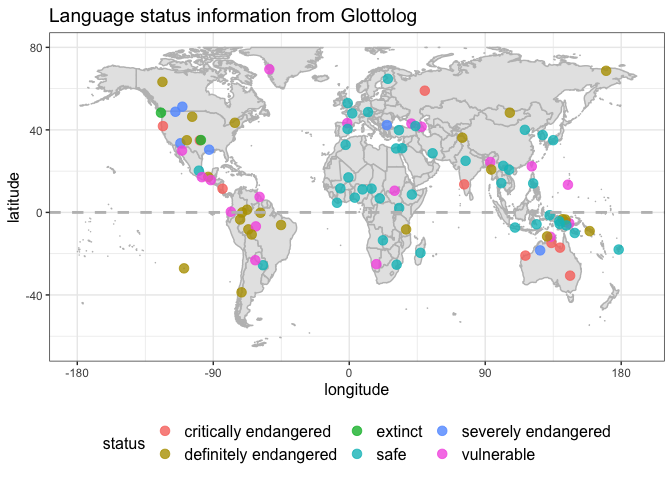
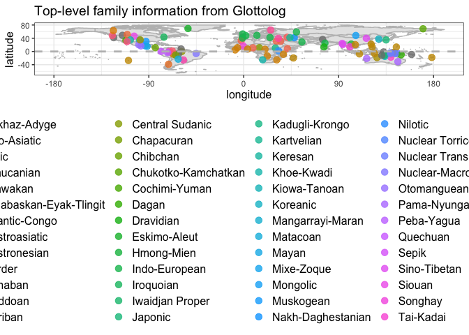

Generate world maps from the 100 LC language sample
================
Chris Bentz, Steven Moran
25 March, 2020

``` r
library(ggplot2)
library(ggmap)
library(maps)
library(testthat)
```

``` r
# Load file with information on 100 language sample
lang100 <- read.csv("../../LangInfo/langInfo_100LC.csv", header = T)

# Data checks
expect_equal(length(lang100$iso_639_3), 100)
expect_equal(length(lang100$glottocode), 100)
expect_equal(length(levels(lang100$top_level_family)), 60)
expect_equal(length(levels(lang100$genus_wals)), 94)
expect_equal(length(levels(lang100$family_wals)), 68)
expect_equal(length(levels(lang100$macroarea_glotto)), 6)
```

``` r
# WORLD MAP WITH LANGUAGE LOCATIONS FROM GLOTTOLOG AND WALS
world <- map_data("world")
lang100_map <- ggplot() + 
  geom_polygon(data = world, aes(x = long, y = lat, group = group), 
               fill = "grey90", col = "grey") +
  geom_point(data = lang100, aes(x = longitude_glotto, y = latitude_glotto), 
             colour = "red", alpha = 0.8, size = 3, shape = 1) +
  geom_point(data = lang100, aes(x = longitude_wals, y = latitude_wals), 
             colour = "green", alpha = 0.8, size = 2) +
  scale_y_continuous(limits = c(-65, 80)) +
  scale_x_continuous(breaks = c(-180, -90, 0, 90, 180)) +
  geom_hline(aes(yintercept = 0), colour = "grey", size = 1, linetype = 2) +
  labs(x = "longitude", y = "latitude") +
  ggtitle("Language locations from Glottolog and WALS") +
  theme_bw() +
  theme(axis.title.x = element_text(size = 12),
        axis.title.y = element_text(size = 12),
        title=element_text(size = 12),
        legend.title = element_text(size = 10),
        legend.position = "bottom")
lang100_map
```


``` r
# WORLD MAP WITH LANGUAGE STATUS INFORMATION FROM GLOTTOLOG
world <- map_data("world")
status_map <- ggplot() + 
  geom_polygon(data = world, aes(x = long, y = lat, group = group), 
               fill = "grey90", col = "grey") +
  geom_point(data = lang100, aes(x = longitude_glotto, y = latitude_glotto, colour = status), 
             alpha = 0.8, size = 3) +
  scale_y_continuous(limits = c(-65, 80)) +
  scale_x_continuous(breaks = c(-180, -90, 0, 90, 180)) +
  geom_hline(aes(yintercept = 0), colour = "grey", size = 1, linetype = 2) +
  labs(x = "longitude", y = "latitude") +
  ggtitle("Language status information from Glottolog") +
  theme_bw() +
  theme(axis.title.x = element_text(size = 12),
        axis.title.y = element_text(size = 12),
        title = element_text(size = 12),
        legend.title = element_text(size = 12),
        legend.text = element_text(size = 12),
        legend.position = "bottom")
status_map
```



``` r
# ggsave("worldmap_status.pdf", status_map, dpi = 300, scale = 1, device = cairo_pdf)
```

``` r
# WORLD MAP WITH TOP-LEVEL FAMILY INFORMATION FROM GLOTTOLOG
world <- map_data("world")
family_map <- ggplot() + 
  geom_polygon(data = world, aes(x = long, y = lat, group = group), 
               fill = "grey90", col = "grey") +
  geom_point(data = lang100, aes(x = longitude_glotto, y = latitude_glotto, colour = top_level_family), 
             alpha = 0.8, size = 3) +
  scale_y_continuous(limits = c(-65, 80)) +
  scale_x_continuous(breaks = c(-180, -90, 0, 90, 180)) +
  geom_hline(aes(yintercept = 0), colour = "grey", size = 1, linetype = 2) +
  labs(x = "longitude", y = "latitude") +
  ggtitle("Top-level family information from Glottolog") +
  theme_bw() +
  theme(axis.title.x = element_text(size = 12),
        axis.title.y = element_text(size = 12),
        title = element_text(size = 12),
        legend.title = element_text(size = 12),
        legend.text = element_text(size = 12),
        legend.position = "bottom")
family_map
```



``` r
# ggsave("worldmap_family.pdf", family_map, dpi = 300, scale = 1, device = cairo_pdf)
```

``` r
# WORLD MAP WITH MACROAREA INFORMATION FROM GLOTTOLOG
world <- map_data("world")
macroarea_map <- ggplot() + 
  geom_polygon(data = world, aes(x = long, y = lat, group = group), 
               fill = "grey90", col = "grey") +
  geom_point(data = lang100, aes(x = longitude_glotto, y = latitude_glotto, colour = macroarea_glotto), 
             alpha = 0.8, size = 3) +
  scale_y_continuous(limits = c(-65, 80)) +
  scale_x_continuous(breaks = c(-180, -90, 0, 90, 180)) +
  geom_hline(aes(yintercept = 0), colour = "grey", size = 1, linetype = 2) +
  labs(x = "longitude", y = "latitude") +
  ggtitle("Macroarea information from Glottolog") +
  theme_bw() +
  theme(axis.title.x = element_text(size = 12),
        axis.title.y = element_text(size = 12),
        title = element_text(size = 12),
        legend.title = element_text(size = 12),
        legend.text = element_text(size = 12))
macroarea_map
```


``` r
# ggsave("worldmap_family.pdf", macroarea_map, dpi = 300, scale = 1, device = cairo_pdf)
```
