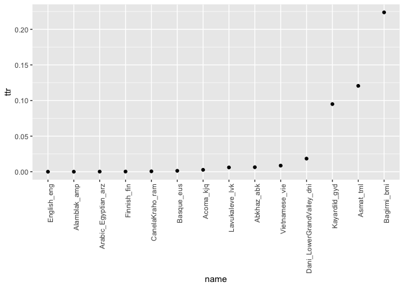

Grapheme TTR in 100LC
================
Steven Moran
17 July, 2020

Load each grapheme orthography profile (OP) from disk, generate TTRs,
and write to a table.

``` r
# Create results data frame
header <- c("name", "types", "tokens", "ttr")
results <- as.data.frame(matrix(,0,length(header)))
names(results) <- header

# Loop over the OPs
fils <- list.files("../graphemes/orthography_profiles", pattern="csv$", full.names = TRUE, recursive = TRUE)

# Test:
# file <- fils[1]

for (file in fils) {
  # Get language name from file path
  s <- unlist(strsplit(file, "/"))
  filename <- tail(s, n=1)
  filename <- str_remove(filename, ".csv")
  
  # Read the OP
  df <- read.csv(file=file)

  # Get ttr
  tokens <- sum(df$Frequency)
  types <- length(unique(df$Grapheme))
  ttr <- (types / tokens)
  
  # Add to results data frame
  result <- c(filename, types, tokens, ttr)
  # results <- rbind(results, result)
  results[nrow(results) + 1,] <- result
}

# Clean up
results$types <- as.integer(results$types)
results$tokens <- as.integer(results$tokens)
results$ttr <- as.numeric(results$ttr)
```

``` r
results %>% kable()
```

| name                        | types |  tokens |       ttr |
| :-------------------------- | ----: | ------: | --------: |
| Abkhaz\_abk                 |    64 |   10003 | 0.0063981 |
| Acoma\_kjq                  |    43 |   15893 | 0.0027056 |
| Alamblak\_amp               |    66 | 1290455 | 0.0000511 |
| Arabic\_Egyptian\_arz       |   426 | 1961436 | 0.0002172 |
| Asmat\_tml                  |    24 |     199 | 0.1206030 |
| Bagirmi\_bmi                |    47 |     210 | 0.2238095 |
| Basque\_eus                 |    71 |   53270 | 0.0013328 |
| CanelaKraho\_ram            |    79 |  130177 | 0.0006069 |
| Dani\_LowerGrandValley\_dni |    33 |    1789 | 0.0184461 |
| English\_eng                |    78 | 3125326 | 0.0000250 |
| Finnish\_fin                |    81 |  278739 | 0.0002906 |
| Kayardild\_gyd              |    21 |     221 | 0.0950226 |
| Lavukaleve\_lvk             |    46 |    7575 | 0.0060726 |
| Vietnamese\_vie             |   134 |   15543 | 0.0086212 |

Write the results to CSV.

``` r
write.csv(results, file="graphemes_ttr.csv", row.names=FALSE)
```

Plot the TTR for graphemes.

``` r
library(ggplot2)
p <- results
p$name <- factor(p$name, levels = p$name[order(p$ttr)])
qplot(name, ttr, data=p) +
  theme(axis.text.x = element_text(angle = 90, hjust = 1))
```

<!-- -->
