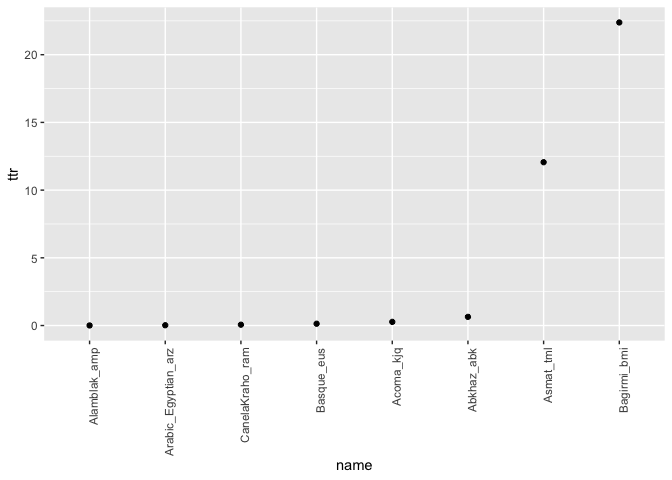

Grapheme TTR in 100LC
================
Steven Moran
14 May, 2020

``` r
# Query the database and return a dataframe
db.file <- '../../Database/words.sqlite3'
runsql <- function(sql, dbname=db.file){
  require(RSQLite)
  driver <- dbDriver("SQLite")
  connect <- dbConnect(driver, dbname=dbname);
  closeup <- function(){
    sqliteCloseConnection(connect)
    sqliteCloseDriver(driver)
  }
  dd <- tryCatch(dbGetQuery(connect, sql), finally=closeup)
  return(dd)
}
```

``` r
# Get word token counts
word.level <- runsql('
select name, writing_system, word_text from v_words
')
```

``` r
names <- word.level %>% select(name, writing_system) %>% distinct()
```

``` r
# Todo: split into groups by language / writing system and run tokenization on those
```

``` r
Abkhaz_abk <- word.level %>% filter(name == "Abkhaz_abk")
Abkhaz_abk <- write.profile(Abkhaz_abk$word_text)
Abkhaz_abk$Frequency <- as.integer(Abkhaz_abk$Frequency)
tokens <- sum(Abkhaz_abk$Frequency)
types <- length(unique(Abkhaz_abk$Grapheme))
# Abkhaz_abk %>% arrange(desc(Frequency)) %>% kable()
ttr <- data.frame(name=c("Abkhaz_abk"), ttr=(types / tokens) * 100)
```

``` r
Acoma_kjq <- word.level %>% filter(name == "Acoma_kjq")
Acoma_kjq <- write.profile(Acoma_kjq$word_text)
Acoma_kjq$Frequency <- as.integer(Acoma_kjq$Frequency)
tokens <- sum(Acoma_kjq$Frequency)
types <- length(unique(Acoma_kjq$Grapheme))
# Acoma_kjq %>% arrange(desc(Frequency)) %>% kable()
ttr <- rbind(ttr, data.frame(name=c("Acoma_kjq"), ttr=(types / tokens) * 100))
```

``` r
Alamblak_amp <- word.level %>% filter(name == "Alamblak_amp")
Alamblak_amp <- write.profile(Alamblak_amp$word_text)
Alamblak_amp$Frequency <- as.integer(Alamblak_amp$Frequency)
tokens <- sum(Alamblak_amp$Frequency)
types <- length(unique(Alamblak_amp$Grapheme))
# Alamblak_amp %>% arrange(desc(Frequency)) %>% kable()
ttr <- rbind(ttr, data.frame(name=c("Alamblak_amp"), ttr=(types / tokens) * 100))
```

``` r
Arabic_Egyptian_arz <- word.level %>% filter(name == "Arabic_Egyptian_arz")
Arabic_Egyptian_arz <- write.profile(Arabic_Egyptian_arz$word_text)
Arabic_Egyptian_arz$Frequency <- as.integer(Arabic_Egyptian_arz$Frequency)
tokens <- sum(Arabic_Egyptian_arz$Frequency)
types <- length(unique(Arabic_Egyptian_arz$Grapheme))
# Arabic_Egyptian_arz %>% arrange(desc(Frequency)) %>% kable()
ttr <- rbind(ttr, data.frame(name=c("Arabic_Egyptian_arz"), ttr=(types / tokens) * 100))
```

``` r
Asmat_tml <- word.level %>% filter(name == "Asmat_tml")
Asmat_tml <- write.profile(Asmat_tml$word_text)
Asmat_tml$Frequency <- as.integer(Asmat_tml$Frequency)
tokens <- sum(Asmat_tml$Frequency)
types <- length(unique(Asmat_tml$Grapheme))
# Asmat_tml %>% arrange(desc(Frequency)) %>% kable()
ttr <- rbind(ttr, data.frame(name=c("Asmat_tml"), ttr=(types / tokens) * 100))
```

``` r
Bagirmi_bmi <- word.level %>% filter(name == "Bagirmi_bmi")
Bagirmi_bmi <- write.profile(Bagirmi_bmi$word_text)
Bagirmi_bmi$Frequency <- as.integer(Bagirmi_bmi$Frequency)
tokens <- sum(Bagirmi_bmi$Frequency)
types <- length(unique(Bagirmi_bmi$Grapheme))
# Bagirmi_bmi %>% arrange(desc(Frequency)) %>% kable()
ttr <- rbind(ttr, data.frame(name=c("Bagirmi_bmi"), ttr=(types / tokens) * 100))
```

``` r
Basque_eus <- word.level %>% filter(name == "Basque_eus")
Basque_eus <- write.profile(Basque_eus$word_text)
Basque_eus$Frequency <- as.integer(Basque_eus$Frequency)
tokens <- sum(Basque_eus$Frequency)
types <- length(unique(Basque_eus$Grapheme))
# Basque_eus %>% arrange(desc(Frequency)) %>% kable()
ttr <- rbind(ttr, data.frame(name=c("Basque_eus"), ttr=(types / tokens) * 100))
```

``` r
CanelaKraho_ram <- word.level %>% filter(name == "CanelaKraho_ram")
CanelaKraho_ram <- write.profile(CanelaKraho_ram$word_text)
CanelaKraho_ram$Frequency <- as.integer(CanelaKraho_ram$Frequency)
tokens <- sum(CanelaKraho_ram$Frequency)
types <- length(unique(CanelaKraho_ram$Grapheme))
# CanelaKraho_ram %>% arrange(desc(Frequency)) %>% kable()
ttr <- rbind(ttr, data.frame(name=c("CanelaKraho_ram"), ttr=(types / tokens) * 100))
```

``` r
library(ggplot2)
p <- ttr
p$name <- factor(p$name, levels = p$name[order(ttr$ttr)])
qplot(name, ttr, data=p) +
  theme(axis.text.x = element_text(angle = 90, hjust = 1))
```



``` r
Abkhaz_abk %>% arrange(desc(Frequency)) %>% kable()
```

| Grapheme |  Frequency| Codepoint | UnicodeName                                        |
|:---------|----------:|:----------|:---------------------------------------------------|
| а        |       2463| U+0430    | CYRILLIC SMALL LETTER A                            |
| и        |        791| U+0438    | CYRILLIC SMALL LETTER I                            |
| р        |        746| U+0440    | CYRILLIC SMALL LETTER ER                           |
| ы        |        531| U+044B    | CYRILLIC SMALL LETTER YERU                         |
| ә        |        487| U+04D9    | CYRILLIC SMALL LETTER SCHWA                        |
| у        |        368| U+0443    | CYRILLIC SMALL LETTER U                            |
| з        |        349| U+0437    | CYRILLIC SMALL LETTER ZE                           |
| л        |        315| U+043B    | CYRILLIC SMALL LETTER EL                           |
| н        |        315| U+043D    | CYRILLIC SMALL LETTER EN                           |
| х        |        291| U+0445    | CYRILLIC SMALL LETTER HA                           |
| е        |        270| U+0435    | CYRILLIC SMALL LETTER IE                           |
| м        |        227| U+043C    | CYRILLIC SMALL LETTER EM                           |
| ҭ        |        202| U+04AD    | CYRILLIC SMALL LETTER TE WITH DESCENDER            |
| ь        |        199| U+044C    | CYRILLIC SMALL LETTER SOFT SIGN                    |
| о        |        172| U+043E    | CYRILLIC SMALL LETTER O                            |
| к        |        166| U+043A    | CYRILLIC SMALL LETTER KA                           |
| г        |        162| U+0433    | CYRILLIC SMALL LETTER GHE                          |
| ш        |        158| U+0448    | CYRILLIC SMALL LETTER SHA                          |
| қ        |        151| U+049B    | CYRILLIC SMALL LETTER KA WITH DESCENDER            |
| ,        |        142| U+002C    | COMMA                                              |
| д        |        133| U+0434    | CYRILLIC SMALL LETTER DE                           |
| б        |        118| U+0431    | CYRILLIC SMALL LETTER BE                           |
| с        |        118| U+0441    | CYRILLIC SMALL LETTER ES                           |
| т        |        115| U+0442    | CYRILLIC SMALL LETTER TE                           |
| ҧ        |        102| U+04A7    | CYRILLIC SMALL LETTER PE WITH MIDDLE HOOK          |
| ҩ        |         90| U+04A9    | CYRILLIC SMALL LETTER ABKHASIAN HA                 |
| п        |         84| U+043F    | CYRILLIC SMALL LETTER PE                           |
| ц        |         82| U+0446    | CYRILLIC SMALL LETTER TSE                          |
| ҵ        |         73| U+04B5    | CYRILLIC SMALL LIGATURE TE TSE                     |
| .        |         66| U+002E    | FULL STOP                                          |
| А        |         66| U+0410    | CYRILLIC CAPITAL LETTER A                          |
| ҟ        |         66| U+049F    | CYRILLIC SMALL LETTER KA WITH STROKE               |
| ҳ        |         56| U+04B3    | CYRILLIC SMALL LETTER HA WITH DESCENDER            |
| ӡ        |         44| U+04E1    | CYRILLIC SMALL LETTER ABKHASIAN DZE                |
| ҷ        |         40| U+04B7    | CYRILLIC SMALL LETTER CHE WITH DESCENDER           |
| Д        |         39| U+0414    | CYRILLIC CAPITAL LETTER DE                         |
| ж        |         35| U+0436    | CYRILLIC SMALL LETTER ZHE                          |
| ҿ        |         28| U+04BF    | CYRILLIC SMALL LETTER ABKHASIAN CHE WITH DESCENDER |
| ч        |         19| U+0447    | CYRILLIC SMALL LETTER CHE                          |
| ҕ        |         14| U+0495    | CYRILLIC SMALL LETTER GHE WITH MIDDLE HOOK         |
| 1        |         13| U+0031    | DIGIT ONE                                          |
| 2        |         13| U+0032    | DIGIT TWO                                          |
| ‐        |         10| U+2010    | HYPHEN                                             |
| ҽ        |          9| U+04BD    | CYRILLIC SMALL LETTER ABKHASIAN CHE                |
| џ        |          8| U+045F    | CYRILLIC SMALL LETTER DZHE                         |
| Е        |          6| U+0415    | CYRILLIC CAPITAL LETTER IE                         |
| Р        |          6| U+0420    | CYRILLIC CAPITAL LETTER ER                         |
| 3        |          4| U+0033    | DIGIT THREE                                        |
| 4        |          4| U+0034    | DIGIT FOUR                                         |
| ;        |          3| U+003B    | SEMICOLON                                          |
| 0        |          3| U+0030    | DIGIT ZERO                                         |
| 5        |          3| U+0035    | DIGIT FIVE                                         |
| 6        |          3| U+0036    | DIGIT SIX                                          |
| 7        |          3| U+0037    | DIGIT SEVEN                                        |
| 8        |          3| U+0038    | DIGIT EIGHT                                        |
| 9        |          3| U+0039    | DIGIT NINE                                         |
| З        |          3| U+0417    | CYRILLIC CAPITAL LETTER ZE                         |
| У        |          3| U+0423    | CYRILLIC CAPITAL LETTER U                          |
| ф        |          3| U+0444    | CYRILLIC SMALL LETTER EF                           |
| –        |          2| U+2013    | EN DASH                                            |
| И        |          2| U+0418    | CYRILLIC CAPITAL LETTER I                          |
| в        |          1| U+0432    | CYRILLIC SMALL LETTER VE                           |
| Н        |          1| U+041D    | CYRILLIC CAPITAL LETTER EN                         |
| Х        |          1| U+0425    | CYRILLIC CAPITAL LETTER HA                         |

``` r
Acoma_kjq %>% arrange(desc(Frequency)) %>% kable()
```

| Grapheme |  Frequency| Codepoint      | UnicodeName                                      |
|:---------|----------:|:---------------|:-------------------------------------------------|
| ′        |       1728| U+2032         | PRIME                                            |
| a        |       1461| U+0061         | LATIN SMALL LETTER A                             |
| i        |       1140| U+0069         | LATIN SMALL LETTER I                             |
| c        |       1019| U+0063         | LATIN SMALL LETTER C                             |
| ᴛ        |        860| U+1D1B         | LATIN LETTER SMALL CAPITAL T                     |
| t        |        837| U+0074         | LATIN SMALL LETTER T                             |
| ʸ        |        813| U+02B8         | MODIFIER LETTER SMALL Y                          |
| ˑ        |        811| U+02D1         | MODIFIER LETTER HALF TRIANGULAR COLON            |
| ε        |        758| U+03B5         | GREEK SMALL LETTER EPSILON                       |
| ʽ        |        697| U+02BD         | MODIFIER LETTER REVERSED COMMA                   |
| s        |        647| U+0073         | LATIN SMALL LETTER S                             |
| ʼ        |        610| U+02BC         | MODIFIER LETTER APOSTROPHE                       |
| n        |        604| U+006E         | LATIN SMALL LETTER N                             |
| α        |        571| U+03B1         | GREEK SMALL LETTER ALPHA                         |
| o        |        472| U+006F         | LATIN SMALL LETTER O                             |
| y        |        298| U+0079         | LATIN SMALL LETTER Y                             |
| .        |        268| U+002E         | FULL STOP                                        |
| k        |        257| U+006B         | LATIN SMALL LETTER K                             |
| m        |        225| U+006D         | LATIN SMALL LETTER M                             |
| ï        |        214| U+00EF         | LATIN SMALL LETTER I WITH DIAERESIS              |
| ᴋ        |        212| U+1D0B         | LATIN LETTER SMALL CAPITAL K                     |
| w        |        200| U+0077         | LATIN SMALL LETTER W                             |
| u        |        198| U+0075         | LATIN SMALL LETTER U                             |
| h        |        172| U+0068         | LATIN SMALL LETTER H                             |
| ꜞ        |        147| U+A71E         | MODIFIER LETTER RAISED INVERTED EXCLAMATION MARK |
| ʋ        |        140| U+028B         | LATIN SMALL LETTER V WITH HOOK                   |
| ı        |        122| U+0131         | LATIN SMALL LETTER DOTLESS I                     |
| -        |        121| U+002D         | HYPHEN-MINUS                                     |
| ᵅ        |         73| U+1D45         | MODIFIER LETTER SMALL ALPHA                      |
| p        |         72| U+0070         | LATIN SMALL LETTER P                             |
| ᵘ        |         43| U+1D58         | MODIFIER LETTER SMALL U                          |
| e        |         37| U+0065         | LATIN SMALL LETTER E                             |
| ᵒ        |         16| U+1D52         | MODIFIER LETTER SMALL O                          |
| ə        |         10| U+0259         | LATIN SMALL LETTER SCHWA                         |
| ᴘ        |         10| U+1D18         | LATIN LETTER SMALL CAPITAL P                     |
| ɔ        |          8| U+0254         | LATIN SMALL LETTER OPEN O                        |
| y̓        |          8| U+0079, U+0313 | LATIN SMALL LETTER Y, COMBINING COMMA ABOVE      |
| r        |          4| U+0072         | LATIN SMALL LETTER R                             |
| T        |          4| U+0054         | LATIN CAPITAL LETTER T                           |
| ᵋ        |          3| U+1D4B         | MODIFIER LETTER SMALL OPEN E                     |
| ˙        |          1| U+02D9         | DOT ABOVE                                        |
| m̓        |          1| U+006D, U+0313 | LATIN SMALL LETTER M, COMBINING COMMA ABOVE      |
| n̓        |          1| U+006E, U+0313 | LATIN SMALL LETTER N, COMBINING COMMA ABOVE      |

``` r
Alamblak_amp %>% arrange(desc(Frequency)) %>% kable()
```

| Grapheme |  Frequency| Codepoint | UnicodeName                 |
|:---------|----------:|:----------|:----------------------------|
| a        |     139721| U+0061    | LATIN SMALL LETTER A        |
| o        |     122190| U+006F    | LATIN SMALL LETTER O        |
| r        |     101975| U+0072    | LATIN SMALL LETTER R        |
| m        |      99110| U+006D    | LATIN SMALL LETTER M        |
| h        |      97331| U+0068    | LATIN SMALL LETTER H        |
| n        |      95840| U+006E    | LATIN SMALL LETTER N        |
| t        |      92612| U+0074    | LATIN SMALL LETTER T        |
| i        |      89513| U+0069    | LATIN SMALL LETTER I        |
| k        |      65413| U+006B    | LATIN SMALL LETTER K        |
| f        |      54064| U+0066    | LATIN SMALL LETTER F        |
| u        |      52253| U+0075    | LATIN SMALL LETTER U        |
| y        |      47245| U+0079    | LATIN SMALL LETTER Y        |
| e        |      35784| U+0065    | LATIN SMALL LETTER E        |
| s        |      21672| U+0073    | LATIN SMALL LETTER S        |
| .        |      21286| U+002E    | FULL STOP                   |
| d        |      20967| U+0064    | LATIN SMALL LETTER D        |
| b        |      20579| U+0062    | LATIN SMALL LETTER B        |
| w        |      19613| U+0077    | LATIN SMALL LETTER W        |
| N        |      13945| U+004E    | LATIN CAPITAL LETTER N      |
| ,        |      11328| U+002C    | COMMA                       |
| p        |      10754| U+0070    | LATIN SMALL LETTER P        |
| g        |       9272| U+0067    | LATIN SMALL LETTER G        |
| B        |       7024| U+0042    | LATIN CAPITAL LETTER B      |
| j        |       5190| U+006A    | LATIN SMALL LETTER J        |
| J        |       3827| U+004A    | LATIN CAPITAL LETTER J      |
| T        |       3055| U+0054    | LATIN CAPITAL LETTER T      |
| “        |       3000| U+201C    | LEFT DOUBLE QUOTATION MARK  |
| ”        |       2999| U+201D    | RIGHT DOUBLE QUOTATION MARK |
| Y        |       2969| U+0059    | LATIN CAPITAL LETTER Y      |
| K        |       2377| U+004B    | LATIN CAPITAL LETTER K      |
| l        |       1978| U+006C    | LATIN SMALL LETTER L        |
| -        |       1852| U+002D    | HYPHEN-MINUS                |
| R        |       1446| U+0052    | LATIN CAPITAL LETTER R      |
| M        |       1268| U+004D    | LATIN CAPITAL LETTER M      |
| W        |       1197| U+0057    | LATIN CAPITAL LETTER W      |
| ?        |       1173| U+003F    | QUESTION MARK               |
| A        |       1015| U+0041    | LATIN CAPITAL LETTER A      |
| S        |        884| U+0053    | LATIN CAPITAL LETTER S      |
| P        |        854| U+0050    | LATIN CAPITAL LETTER P      |
| ’        |        817| U+2019    | RIGHT SINGLE QUOTATION MARK |
| ‘        |        816| U+2018    | LEFT SINGLE QUOTATION MARK  |
| I        |        769| U+0049    | LATIN CAPITAL LETTER I      |
| F        |        617| U+0046    | LATIN CAPITAL LETTER F      |
| H        |        546| U+0048    | LATIN CAPITAL LETTER H      |
| 0        |        365| U+0030    | DIGIT ZERO                  |
| D        |        329| U+0044    | LATIN CAPITAL LETTER D      |
| G        |        231| U+0047    | LATIN CAPITAL LETTER G      |
| O        |        189| U+004F    | LATIN CAPITAL LETTER O      |
| 1        |        176| U+0031    | DIGIT ONE                   |
| !        |        174| U+0021    | EXCLAMATION MARK            |
| E        |        138| U+0045    | LATIN CAPITAL LETTER E      |
| L        |        121| U+004C    | LATIN CAPITAL LETTER L      |
| 7        |        119| U+0037    | DIGIT SEVEN                 |
| 2        |        116| U+0032    | DIGIT TWO                   |
| 4        |         58| U+0034    | DIGIT FOUR                  |
| :        |         56| U+003A    | COLON                       |
| 5        |         43| U+0035    | DIGIT FIVE                  |
| U        |         40| U+0055    | LATIN CAPITAL LETTER U      |
| 6        |         34| U+0036    | DIGIT SIX                   |
| 3        |         33| U+0033    | DIGIT THREE                 |
| (        |         23| U+0028    | LEFT PARENTHESIS            |
| )        |         23| U+0029    | RIGHT PARENTHESIS           |
| 8        |         17| U+0038    | DIGIT EIGHT                 |
| 9        |         16| U+0039    | DIGIT NINE                  |
| v        |         13| U+0076    | LATIN SMALL LETTER V        |
| /        |          1| U+002F    | SOLIDUS                     |

``` r
Arabic_Egyptian_arz %>% arrange(desc(Frequency)) %>% kable()
```

| Grapheme |  Frequency| Codepoint              | UnicodeName                                                      |
|:---------|----------:|:-----------------------|:-----------------------------------------------------------------|
| ا        |     151223| U+0627                 | ARABIC LETTER ALEF                                               |
| ٱ        |      79341| U+0671                 | ARABIC LETTER ALEF WASLA                                         |
| ي        |      67698| U+064A                 | ARABIC LETTER YEH                                                |
| وَ       |      66204| U+0648, U+064E         | ARABIC LETTER WAW, ARABIC FATHA                                  |
| لَ       |      60128| U+0644, U+064E         | ARABIC LETTER LAM, ARABIC FATHA                                  |
| أَ       |      52602| U+0623, U+064E         | ARABIC LETTER ALEF WITH HAMZA ABOVE, ARABIC FATHA                |
| نَ       |      49630| U+0646, U+064E         | ARABIC LETTER NOON, ARABIC FATHA                                 |
| لْ       |      48331| U+0644, U+0652         | ARABIC LETTER LAM, ARABIC SUKUN                                  |
| مَ       |      47551| U+0645, U+064E         | ARABIC LETTER MEEM, ARABIC FATHA                                 |
| و        |      46959| U+0648                 | ARABIC LETTER WAW                                                |
| .        |      36315| U+002E                 | FULL STOP                                                        |
| لِ       |      35586| U+0644, U+0650         | ARABIC LETTER LAM, ARABIC KASRA                                  |
| يَ       |      34374| U+064A, U+064E         | ARABIC LETTER YEH, ARABIC FATHA                                  |
| عَ       |      33676| U+0639, U+064E         | ARABIC LETTER AIN, ARABIC FATHA                                  |
| ،        |      32629| U+060C                 | ARABIC COMMA                                                     |
| كَ       |      32027| U+0643, U+064E         | ARABIC LETTER KAF, ARABIC FATHA                                  |
| رَ       |      29397| U+0631, U+064E         | ARABIC LETTER REH, ARABIC FATHA                                  |
| ل        |      29196| U+0644                 | ARABIC LETTER LAM                                                |
| تَ       |      29091| U+062A, U+064E         | ARABIC LETTER TEH, ARABIC FATHA                                  |
| هُ       |      28691| U+0647, U+064F         | ARABIC LETTER HEH, ARABIC DAMMA                                  |
| بَ       |      28547| U+0628, U+064E         | ARABIC LETTER BEH, ARABIC FATHA                                  |
| مِ       |      27309| U+0645, U+0650         | ARABIC LETTER MEEM, ARABIC KASRA                                 |
| نْ       |      25666| U+0646, U+0652         | ARABIC LETTER NOON, ARABIC SUKUN                                 |
| فَ       |      23963| U+0641, U+064E         | ARABIC LETTER FEH, ARABIC FATHA                                  |
| مْ       |      22731| U+0645, U+0652         | ARABIC LETTER MEEM, ARABIC SUKUN                                 |
| بِ       |      22382| U+0628, U+0650         | ARABIC LETTER BEH, ARABIC KASRA                                  |
| إِ       |      21604| U+0625, U+0650         | ARABIC LETTER ALEF WITH HAMZA BELOW, ARABIC KASRA                |
| هَ       |      20530| U+0647, U+064E         | ARABIC LETTER HEH, ARABIC FATHA                                  |
| قَ       |      20160| U+0642, U+064E         | ARABIC LETTER QAF, ARABIC FATHA                                  |
| يْ       |      19131| U+064A, U+0652         | ARABIC LETTER YEH, ARABIC SUKUN                                  |
| كُ       |      17917| U+0643, U+064F         | ARABIC LETTER KAF, ARABIC DAMMA                                  |
| هِ       |      17830| U+0647, U+0650         | ARABIC LETTER HEH, ARABIC KASRA                                  |
| سَ       |      17792| U+0633, U+064E         | ARABIC LETTER SEEN, ARABIC FATHA                                 |
| ى        |      17422| U+0649                 | ARABIC LETTER ALEF MAKSURA                                       |
| فِ       |      16571| U+0641, U+0650         | ARABIC LETTER FEH, ARABIC KASRA                                  |
| مُ       |      16061| U+0645, U+064F         | ARABIC LETTER MEEM, ARABIC DAMMA                                 |
| نِ       |      14538| U+0646, U+0650         | ARABIC LETTER NOON, ARABIC KASRA                                 |
| دَ       |      14102| U+062F, U+064E         | ARABIC LETTER DAL, ARABIC FATHA                                  |
| رِ       |      13922| U+0631, U+0650         | ARABIC LETTER REH, ARABIC KASRA                                  |
| حَ       |      13570| U+062D, U+064E         | ARABIC LETTER HAH, ARABIC FATHA                                  |
| جَ       |      12702| U+062C, U+064E         | ARABIC LETTER JEEM, ARABIC FATHA                                 |
| تِ       |      12597| U+062A, U+0650         | ARABIC LETTER TEH, ARABIC KASRA                                  |
| "        |      12352| U+0022                 | QUOTATION MARK                                                   |
| رْ       |      12313| U+0631, U+0652         | ARABIC LETTER REH, ARABIC SUKUN                                  |
| عْ       |      11914| U+0639, U+0652         | ARABIC LETTER AIN, ARABIC SUKUN                                  |
| لَّ      |      11789| U+0644, U+064E, U+0651 | ARABIC LETTER LAM, ARABIC FATHA, ARABIC SHADDA                   |
| تُ       |      11480| U+062A, U+064F         | ARABIC LETTER TEH, ARABIC DAMMA                                  |
| لُ       |      11412| U+0644, U+064F         | ARABIC LETTER LAM, ARABIC DAMMA                                  |
| رُ       |      11323| U+0631, U+064F         | ARABIC LETTER REH, ARABIC DAMMA                                  |
| ذَ       |      11213| U+0630, U+064E         | ARABIC LETTER THAL, ARABIC FATHA                                 |
| سْ       |      10301| U+0633, U+0652         | ARABIC LETTER SEEN, ARABIC SUKUN                                 |
| بْ       |      10096| U+0628, U+0652         | ARABIC LETTER BEH, ARABIC SUKUN                                  |
| نَّ      |      10011| U+0646, U+064E, U+0651 | ARABIC LETTER NOON, ARABIC FATHA, ARABIC SHADDA                  |
| نُ       |       9795| U+0646, U+064F         | ARABIC LETTER NOON, ARABIC DAMMA                                 |
| دِ       |       9527| U+062F, U+0650         | ARABIC LETTER DAL, ARABIC KASRA                                  |
| رَّ      |       9089| U+0631, U+064E, U+0651 | ARABIC LETTER REH, ARABIC FATHA, ARABIC SHADDA                   |
| :        |       8805| U+003A                 | COLON                                                            |
| ةِ       |       8775| U+0629, U+0650         | ARABIC LETTER TEH MARBUTA, ARABIC KASRA                          |
| ئِ       |       8741| U+0626, U+0650         | ARABIC LETTER YEH WITH HAMZA ABOVE, ARABIC KASRA                 |
| خَ       |       8653| U+062E, U+064E         | ARABIC LETTER KHAH, ARABIC FATHA                                 |
| يُ       |       8625| U+064A, U+064F         | ARABIC LETTER YEH, ARABIC DAMMA                                  |
| وْ       |       8155| U+0648, U+0652         | ARABIC LETTER WAW, ARABIC SUKUN                                  |
| شَ       |       8151| U+0634, U+064E         | ARABIC LETTER SHEEN, ARABIC FATHA                                |
| عُ       |       7684| U+0639, U+064F         | ARABIC LETTER AIN, ARABIC DAMMA                                  |
| عِ       |       7511| U+0639, U+0650         | ARABIC LETTER AIN, ARABIC KASRA                                  |
| بُ       |       7227| U+0628, U+064F         | ARABIC LETTER BEH, ARABIC DAMMA                                  |
| سِ       |       7199| U+0633, U+0650         | ARABIC LETTER SEEN, ARABIC KASRA                                 |
| دُ       |       7162| U+062F, U+064F         | ARABIC LETTER DAL, ARABIC DAMMA                                  |
| قُ       |       7085| U+0642, U+064F         | ARABIC LETTER QAF, ARABIC DAMMA                                  |
| ذِ       |       6633| U+0630, U+0650         | ARABIC LETTER THAL, ARABIC KASRA                                 |
| كِ       |       6352| U+0643, U+0650         | ARABIC LETTER KAF, ARABIC KASRA                                  |
| حِ       |       6325| U+062D, U+0650         | ARABIC LETTER HAH, ARABIC KASRA                                  |
| أُ       |       6056| U+0623, U+064F         | ARABIC LETTER ALEF WITH HAMZA ABOVE, ARABIC DAMMA                |
| حْ       |       5992| U+062D, U+0652         | ARABIC LETTER HAH, ARABIC SUKUN                                  |
| صَ       |       5925| U+0635, U+064E         | ARABIC LETTER SAD, ARABIC FATHA                                  |
| يَّ      |       5753| U+064A, U+064E, U+0651 | ARABIC LETTER YEH, ARABIC FATHA, ARABIC SHADDA                   |
| دْ       |       5639| U+062F, U+0652         | ARABIC LETTER DAL, ARABIC SUKUN                                  |
| سُ       |       5344| U+0633, U+064F         | ARABIC LETTER SEEN, ARABIC DAMMA                                 |
| طَ       |       5127| U+0637, U+064E         | ARABIC LETTER TAH, ARABIC FATHA                                  |
| قِ       |       5111| U+0642, U+0650         | ARABIC LETTER QAF, ARABIC KASRA                                  |
| جْ       |       4744| U+062C, U+0652         | ARABIC LETTER JEEM, ARABIC SUKUN                                 |
| آ        |       4528| U+0622                 | ARABIC LETTER ALEF WITH MADDA ABOVE                              |
| فْ       |       4478| U+0641, U+0652         | ARABIC LETTER FEH, ARABIC SUKUN                                  |
| ةَ       |       4327| U+0629, U+064E         | ARABIC LETTER TEH MARBUTA, ARABIC FATHA                          |
| خْ       |       4266| U+062E, U+0652         | ARABIC LETTER KHAH, ARABIC SUKUN                                 |
| تْ       |       4224| U+062A, U+0652         | ARABIC LETTER TEH, ARABIC SUKUN                                  |
| مَّ      |       4197| U+0645, U+064E, U+0651 | ARABIC LETTER MEEM, ARABIC FATHA, ARABIC SHADDA                  |
| جُ       |       3927| U+062C, U+064F         | ARABIC LETTER JEEM, ARABIC DAMMA                                 |
| جِ       |       3899| U+062C, U+0650         | ARABIC LETTER JEEM, ARABIC KASRA                                 |
| بُّ      |       3859| U+0628, U+064F, U+0651 | ARABIC LETTER BEH, ARABIC DAMMA, ARABIC SHADDA                   |
| ةً       |       3817| U+0629, U+064B         | ARABIC LETTER TEH MARBUTA, ARABIC FATHATAN                       |
| قْ       |       3812| U+0642, U+0652         | ARABIC LETTER QAF, ARABIC SUKUN                                  |
| ثَ       |       3741| U+062B, U+064E         | ARABIC LETTER THEH, ARABIC FATHA                                 |
| سَّ      |       3701| U+0633, U+064E, U+0651 | ARABIC LETTER SEEN, ARABIC FATHA, ARABIC SHADDA                  |
| طِ       |       3668| U+0637, U+0650         | ARABIC LETTER TAH, ARABIC KASRA                                  |
| ضَ       |       3667| U+0636, U+064E         | ARABIC LETTER DAD, ARABIC FATHA                                  |
| بِّ      |       3645| U+0628, U+0650, U+0651 | ARABIC LETTER BEH, ARABIC KASRA, ARABIC SHADDA                   |
| ضِ       |       3621| U+0636, U+0650         | ARABIC LETTER DAD, ARABIC KASRA                                  |
| ةُ       |       3588| U+0629, U+064F         | ARABIC LETTER TEH MARBUTA, ARABIC DAMMA                          |
| لِّ      |       3446| U+0644, U+0650, U+0651 | ARABIC LETTER LAM, ARABIC KASRA, ARABIC SHADDA                   |
| صْ       |       3236| U+0635, U+0652         | ARABIC LETTER SAD, ARABIC SUKUN                                  |
| يِّ      |       3215| U+064A, U+0650, U+0651 | ARABIC LETTER YEH, ARABIC KASRA, ARABIC SHADDA                   |
| ؟        |       3111| U+061F                 | ARABIC QUESTION MARK                                             |
| زَ       |       3099| U+0632, U+064E         | ARABIC LETTER ZAIN, ARABIC FATHA                                 |
| غَ       |       3022| U+063A, U+064E         | ARABIC LETTER GHAIN, ARABIC FATHA                                |
| ةٍ       |       3013| U+0629, U+064D         | ARABIC LETTER TEH MARBUTA, ARABIC KASRATAN                       |
| حُ       |       2851| U+062D, U+064F         | ARABIC LETTER HAH, ARABIC DAMMA                                  |
| أْ       |       2776| U+0623, U+0652         | ARABIC LETTER ALEF WITH HAMZA ABOVE, ARABIC SUKUN                |
| هْ       |       2616| U+0647, U+0652         | ARABIC LETTER HEH, ARABIC SUKUN                                  |
| شَّ      |       2612| U+0634, U+064E, U+0651 | ARABIC LETTER SHEEN, ARABIC FATHA, ARABIC SHADDA                 |
| فُ       |       2604| U+0641, U+064F         | ARABIC LETTER FEH, ARABIC DAMMA                                  |
| شْ       |       2599| U+0634, U+0652         | ARABIC LETTER SHEEN, ARABIC SUKUN                                |
| ذْ       |       2592| U+0630, U+0652         | ARABIC LETTER THAL, ARABIC SUKUN                                 |
| ءِ       |       2554| U+0621, U+0650         | ARABIC LETTER HAMZA, ARABIC KASRA                                |
| دَّ      |       2532| U+062F, U+064E, U+0651 | ARABIC LETTER DAL, ARABIC FATHA, ARABIC SHADDA                   |
| خُ       |       2444| U+062E, U+064F         | ARABIC LETTER KHAH, ARABIC DAMMA                                 |
| كْ       |       2443| U+0643, U+0652         | ARABIC LETTER KAF, ARABIC SUKUN                                  |
| تَّ      |       2425| U+062A, U+064E, U+0651 | ARABIC LETTER TEH, ARABIC FATHA, ARABIC SHADDA                   |
| لً       |       2219| U+0644, U+064B         | ARABIC LETTER LAM, ARABIC FATHATAN                               |
| ةٌ       |       2209| U+0629, U+064C         | ARABIC LETTER TEH MARBUTA, ARABIC DAMMATAN                       |
| لُّ      |       2203| U+0644, U+064F, U+0651 | ARABIC LETTER LAM, ARABIC DAMMA, ARABIC SHADDA                   |
| ءَ       |       2148| U+0621, U+064E         | ARABIC LETTER HAMZA, ARABIC FATHA                                |
| صِ       |       2136| U+0635, U+0650         | ARABIC LETTER SAD, ARABIC KASRA                                  |
| وُ       |       2116| U+0648, U+064F         | ARABIC LETTER WAW, ARABIC DAMMA                                  |
| رِّ      |       2007| U+0631, U+0650, U+0651 | ARABIC LETTER REH, ARABIC KASRA, ARABIC SHADDA                   |
| ثُ       |       1987| U+062B, U+064F         | ARABIC LETTER THEH, ARABIC DAMMA                                 |
| نِّ      |       1982| U+0646, U+0650, U+0651 | ARABIC LETTER NOON, ARABIC KASRA, ARABIC SHADDA                  |
| خِ       |       1958| U+062E, U+0650         | ARABIC LETTER KHAH, ARABIC KASRA                                 |
| شِ       |       1847| U+0634, U+0650         | ARABIC LETTER SHEEN, ARABIC KASRA                                |
| ضً       |       1825| U+0636, U+064B         | ARABIC LETTER DAD, ARABIC FATHATAN                               |
| طْ       |       1806| U+0637, U+0652         | ARABIC LETTER TAH, ARABIC SUKUN                                  |
| بَّ      |       1743| U+0628, U+064E, U+0651 | ARABIC LETTER BEH, ARABIC FATHA, ARABIC SHADDA                   |
| ثْ       |       1686| U+062B, U+0652         | ARABIC LETTER THEH, ARABIC SUKUN                                 |
| ثِ       |       1662| U+062B, U+0650         | ARABIC LETTER THEH, ARABIC KASRA                                 |
| زِ       |       1562| U+0632, U+0650         | ARABIC LETTER ZAIN, ARABIC KASRA                                 |
| يُّ      |       1488| U+064A, U+064F, U+0651 | ARABIC LETTER YEH, ARABIC DAMMA, ARABIC SHADDA                   |
| رً       |       1432| U+0631, U+064B         | ARABIC LETTER REH, ARABIC FATHATAN                               |
| شُ       |       1428| U+0634, U+064F         | ARABIC LETTER SHEEN, ARABIC DAMMA                                |
| طُ       |       1421| U+0637, U+064F         | ARABIC LETTER TAH, ARABIC DAMMA                                  |
| وِ       |       1340| U+0648, U+0650         | ARABIC LETTER WAW, ARABIC KASRA                                  |
| !        |       1301| U+0021                 | EXCLAMATION MARK                                                 |
| ذُ       |       1245| U+0630, U+064F         | ARABIC LETTER THAL, ARABIC DAMMA                                 |
| مً       |       1150| U+0645, U+064B         | ARABIC LETTER MEEM, ARABIC FATHATAN                              |
| ظَ       |       1142| U+0638, U+064E         | ARABIC LETTER ZAH, ARABIC FATHA                                  |
| رٍ       |       1138| U+0631, U+064D         | ARABIC LETTER REH, ARABIC KASRATAN                               |
| ئَ       |       1123| U+0626, U+064E         | ARABIC LETTER YEH WITH HAMZA ABOVE, ARABIC FATHA                 |
| ضُ       |       1122| U+0636, U+064F         | ARABIC LETTER DAD, ARABIC DAMMA                                  |
| وَّ      |       1119| U+0648, U+064E, U+0651 | ARABIC LETTER WAW, ARABIC FATHA, ARABIC SHADDA                   |
| يِ       |       1074| U+064A, U+0650         | ARABIC LETTER YEH, ARABIC KASRA                                  |
| مٍ       |       1070| U+0645, U+064D         | ARABIC LETTER MEEM, ARABIC KASRATAN                              |
| دٌ       |       1060| U+062F, U+064C         | ARABIC LETTER DAL, ARABIC DAMMATAN                               |
| صُ       |       1056| U+0635, U+064F         | ARABIC LETTER SAD, ARABIC DAMMA                                  |
| دٍ       |       1053| U+062F, U+064D         | ARABIC LETTER DAL, ARABIC KASRATAN                               |
| رُّ      |       1038| U+0631, U+064F, U+0651 | ARABIC LETTER REH, ARABIC DAMMA, ARABIC SHADDA                   |
| دً       |       1016| U+062F, U+064B         | ARABIC LETTER DAL, ARABIC FATHATAN                               |
| ءُ       |       1001| U+0621, U+064F         | ARABIC LETTER HAMZA, ARABIC DAMMA                                |
| ظِ       |        984| U+0638, U+0650         | ARABIC LETTER ZAH, ARABIC KASRA                                  |
| زْ       |        977| U+0632, U+0652         | ARABIC LETTER ZAIN, ARABIC SUKUN                                 |
| ضْ       |        960| U+0636, U+0652         | ARABIC LETTER DAD, ARABIC SUKUN                                  |
| صَّ      |        952| U+0635, U+064E, U+0651 | ARABIC LETTER SAD, ARABIC FATHA, ARABIC SHADDA                   |
| ظُ       |        945| U+0638, U+064F         | ARABIC LETTER ZAH, ARABIC DAMMA                                  |
| ؤُ       |        929| U+0624, U+064F         | ARABIC LETTER WAW WITH HAMZA ABOVE, ARABIC DAMMA                 |
| دِّ      |        914| U+062F, U+0650, U+0651 | ARABIC LETTER DAL, ARABIC KASRA, ARABIC SHADDA                   |
| غْ       |        894| U+063A, U+0652         | ARABIC LETTER GHAIN, ARABIC SUKUN                                |
| نٍ       |        886| U+0646, U+064D         | ARABIC LETTER NOON, ARABIC KASRATAN                              |
| تٍ       |        835| U+062A, U+064D         | ARABIC LETTER TEH, ARABIC KASRATAN                               |
| لٍ       |        819| U+0644, U+064D         | ARABIC LETTER LAM, ARABIC KASRATAN                               |
| نً       |        819| U+0646, U+064B         | ARABIC LETTER NOON, ARABIC FATHATAN                              |
| رٌ       |        808| U+0631, U+064C         | ARABIC LETTER REH, ARABIC DAMMATAN                               |
| غِ       |        806| U+063A, U+0650         | ARABIC LETTER GHAIN, ARABIC KASRA                                |
| بٍ       |        785| U+0628, U+064D         | ARABIC LETTER BEH, ARABIC KASRATAN                               |
| بً       |        776| U+0628, U+064B         | ARABIC LETTER BEH, ARABIC FATHATAN                               |
| لٌ       |        730| U+0644, U+064C         | ARABIC LETTER LAM, ARABIC DAMMATAN                               |
| ثَّ      |        719| U+062B, U+064E, U+0651 | ARABIC LETTER THEH, ARABIC FATHA, ARABIC SHADDA                  |
| مٌ       |        715| U+0645, U+064C         | ARABIC LETTER MEEM, ARABIC DAMMATAN                              |
| دُّ      |        695| U+062F, U+064F, U+0651 | ARABIC LETTER DAL, ARABIC DAMMA, ARABIC SHADDA                   |
| شُّ      |        689| U+0634, U+064F, U+0651 | ARABIC LETTER SHEEN, ARABIC DAMMA, ARABIC SHADDA                 |
| ضَّ      |        662| U+0636, U+064E, U+0651 | ARABIC LETTER DAD, ARABIC FATHA, ARABIC SHADDA                   |
| عً       |        629| U+0639, U+064B         | ARABIC LETTER AIN, ARABIC FATHATAN                               |
| نٌ       |        626| U+0646, U+064C         | ARABIC LETTER NOON, ARABIC DAMMATAN                              |
| ؤَ       |        616| U+0624, U+064E         | ARABIC LETTER WAW WITH HAMZA ABOVE, ARABIC FATHA                 |
| بٌ       |        603| U+0628, U+064C         | ARABIC LETTER BEH, ARABIC DAMMATAN                               |
| زُ       |        585| U+0632, U+064F         | ARABIC LETTER ZAIN, ARABIC DAMMA                                 |
| طَّ      |        584| U+0637, U+064E, U+0651 | ARABIC LETTER TAH, ARABIC FATHA, ARABIC SHADDA                   |
| غُ       |        576| U+063A, U+064F         | ARABIC LETTER GHAIN, ARABIC DAMMA                                |
| شِّ      |        534| U+0634, U+0650, U+0651 | ARABIC LETTER SHEEN, ARABIC KASRA, ARABIC SHADDA                 |
| كَّ      |        530| U+0643, U+064E, U+0651 | ARABIC LETTER KAF, ARABIC FATHA, ARABIC SHADDA                   |
| زَّ      |        528| U+0632, U+064E, U+0651 | ARABIC LETTER ZAIN, ARABIC FATHA, ARABIC SHADDA                  |
| اَ       |        527| U+0627, U+064E         | ARABIC LETTER ALEF, ARABIC FATHA                                 |
| ءٍ       |        524| U+0621, U+064D         | ARABIC LETTER HAMZA, ARABIC KASRATAN                             |
| سٍ       |        493| U+0633, U+064D         | ARABIC LETTER SEEN, ARABIC KASRATAN                              |
| سً       |        456| U+0633, U+064B         | ARABIC LETTER SEEN, ARABIC FATHATAN                              |
| جَّ      |        440| U+062C, U+064E, U+0651 | ARABIC LETTER JEEM, ARABIC FATHA, ARABIC SHADDA                  |
| نُّ      |        425| U+0646, U+064F, U+0651 | ARABIC LETTER NOON, ARABIC DAMMA, ARABIC SHADDA                  |
| مِّ      |        420| U+0645, U+0650, U+0651 | ARABIC LETTER MEEM, ARABIC KASRA, ARABIC SHADDA                  |
| ؤْ       |        417| U+0624, U+0652         | ARABIC LETTER WAW WITH HAMZA ABOVE, ARABIC SUKUN                 |
| اِ       |        411| U+0627, U+0650         | ARABIC LETTER ALEF, ARABIC KASRA                                 |
| قَّ      |        400| U+0642, U+064E, U+0651 | ARABIC LETTER QAF, ARABIC FATHA, ARABIC SHADDA                   |
| فً       |        391| U+0641, U+064B         | ARABIC LETTER FEH, ARABIC FATHATAN                               |
| مُّ      |        390| U+0645, U+064F, U+0651 | ARABIC LETTER MEEM, ARABIC DAMMA, ARABIC SHADDA                  |
| عٍ       |        381| U+0639, U+064D         | ARABIC LETTER AIN, ARABIC KASRATAN                               |
| ظْ       |        377| U+0638, U+0652         | ARABIC LETTER ZAH, ARABIC SUKUN                                  |
| سِّ      |        362| U+0633, U+0650, U+0651 | ARABIC LETTER SEEN, ARABIC KASRA, ARABIC SHADDA                  |
| فٍ       |        362| U+0641, U+064D         | ARABIC LETTER FEH, ARABIC KASRATAN                               |
| حً       |        358| U+062D, U+064B         | ARABIC LETTER HAH, ARABIC FATHATAN                               |
| دًّ      |        355| U+062F, U+064B, U+0651 | ARABIC LETTER DAL, ARABIC FATHATAN, ARABIC SHADDA                |
| ذَّ      |        353| U+0630, U+064E, U+0651 | ARABIC LETTER THAL, ARABIC FATHA, ARABIC SHADDA                  |
| سُّ      |        353| U+0633, U+064F, U+0651 | ARABIC LETTER SEEN, ARABIC DAMMA, ARABIC SHADDA                  |
| يٌّ      |        323| U+064A, U+064C, U+0651 | ARABIC LETTER YEH, ARABIC DAMMATAN, ARABIC SHADDA                |
| ئُ       |        311| U+0626, U+064F         | ARABIC LETTER YEH WITH HAMZA ABOVE, ARABIC DAMMA                 |
| تِّ      |        310| U+062A, U+0650, U+0651 | ARABIC LETTER TEH, ARABIC KASRA, ARABIC SHADDA                   |
| وِّ      |        307| U+0648, U+0650, U+0651 | ARABIC LETTER WAW, ARABIC KASRA, ARABIC SHADDA                   |
| سٌ       |        301| U+0633, U+064C         | ARABIC LETTER SEEN, ARABIC DAMMATAN                              |
| تُّ      |        294| U+062A, U+064F, U+0651 | ARABIC LETTER TEH, ARABIC DAMMA, ARABIC SHADDA                   |
| ذٍ       |        291| U+0630, U+064D         | ARABIC LETTER THAL, ARABIC KASRATAN                              |
| ءٌ       |        283| U+0621, U+064C         | ARABIC LETTER HAMZA, ARABIC DAMMATAN                             |
| ءً       |        280| U+0621, U+064B         | ARABIC LETTER HAMZA, ARABIC FATHATAN                             |
| قِّ      |        278| U+0642, U+0650, U+0651 | ARABIC LETTER QAF, ARABIC KASRA, ARABIC SHADDA                   |
| تً       |        277| U+062A, U+064B         | ARABIC LETTER TEH, ARABIC FATHATAN                               |
| ئْ       |        274| U+0626, U+0652         | ARABIC LETTER YEH WITH HAMZA ABOVE, ARABIC SUKUN                 |
| فٌ       |        274| U+0641, U+064C         | ARABIC LETTER FEH, ARABIC DAMMATAN                               |
| ئً       |        244| U+0626, U+064B         | ARABIC LETTER YEH WITH HAMZA ABOVE, ARABIC FATHATAN              |
| عٌ       |        242| U+0639, U+064C         | ARABIC LETTER AIN, ARABIC DAMMATAN                               |
| حٍ       |        241| U+062D, U+064D         | ARABIC LETTER HAH, ARABIC KASRATAN                               |
| كً       |        241| U+0643, U+064B         | ARABIC LETTER KAF, ARABIC FATHATAN                               |
| يًّ      |        241| U+064A, U+064B, U+0651 | ARABIC LETTER YEH, ARABIC FATHATAN, ARABIC SHADDA                |
| تٌ       |        240| U+062A, U+064C         | ARABIC LETTER TEH, ARABIC DAMMATAN                               |
| حٌ       |        235| U+062D, U+064C         | ARABIC LETTER HAH, ARABIC DAMMATAN                               |
| جِّ      |        228| U+062C, U+0650, U+0651 | ARABIC LETTER JEEM, ARABIC KASRA, ARABIC SHADDA                  |
| زِّ      |        220| U+0632, U+0650, U+0651 | ARABIC LETTER ZAIN, ARABIC KASRA, ARABIC SHADDA                  |
| صِّ      |        218| U+0635, U+0650, U+0651 | ARABIC LETTER SAD, ARABIC KASRA, ARABIC SHADDA                   |
| ضٍ       |        211| U+0636, U+064D         | ARABIC LETTER DAD, ARABIC KASRATAN                               |
| فَّ      |        210| U+0641, U+064E, U+0651 | ARABIC LETTER FEH, ARABIC FATHA, ARABIC SHADDA                   |
| قً       |        207| U+0642, U+064B         | ARABIC LETTER QAF, ARABIC FATHATAN                               |
| قٍ       |        195| U+0642, U+064D         | ARABIC LETTER QAF, ARABIC KASRATAN                               |
| صُّ      |        188| U+0635, U+064F, U+0651 | ARABIC LETTER SAD, ARABIC DAMMA, ARABIC SHADDA                   |
| ثِّ      |        185| U+062B, U+0650, U+0651 | ARABIC LETTER THEH, ARABIC KASRA, ARABIC SHADDA                  |
| رًّ      |        184| U+0631, U+064B, U+0651 | ARABIC LETTER REH, ARABIC FATHATAN, ARABIC SHADDA                |
| يٍّ      |        180| U+064A, U+064D, U+0651 | ARABIC LETTER YEH, ARABIC KASRATAN, ARABIC SHADDA                |
| زً       |        175| U+0632, U+064B         | ARABIC LETTER ZAIN, ARABIC FATHATAN                              |
| يً       |        172| U+064A, U+064B         | ARABIC LETTER YEH, ARABIC FATHATAN                               |
| كٌ       |        169| U+0643, U+064C         | ARABIC LETTER KAF, ARABIC DAMMATAN                               |
| طِّ      |        153| U+0637, U+0650, U+0651 | ARABIC LETTER TAH, ARABIC KASRA, ARABIC SHADDA                   |
| اُ       |        152| U+0627, U+064F         | ARABIC LETTER ALEF, ARABIC DAMMA                                 |
| كِّ      |        152| U+0643, U+0650, U+0651 | ARABIC LETTER KAF, ARABIC KASRA, ARABIC SHADDA                   |
| ظَّ      |        149| U+0638, U+064E, U+0651 | ARABIC LETTER ZAH, ARABIC FATHA, ARABIC SHADDA                   |
| فِّ      |        145| U+0641, U+0650, U+0651 | ARABIC LETTER FEH, ARABIC KASRA, ARABIC SHADDA                   |
| قٌ       |        140| U+0642, U+064C         | ARABIC LETTER QAF, ARABIC DAMMATAN                               |
| جٍ       |        137| U+062C, U+064D         | ARABIC LETTER JEEM, ARABIC KASRATAN                              |
| قُّ      |        136| U+0642, U+064F, U+0651 | ARABIC LETTER QAF, ARABIC DAMMA, ARABIC SHADDA                   |
| طُّ      |        129| U+0637, U+064F, U+0651 | ARABIC LETTER TAH, ARABIC DAMMA, ARABIC SHADDA                   |
| ذً       |        128| U+0630, U+064B         | ARABIC LETTER THAL, ARABIC FATHATAN                              |
| ظُّ      |        127| U+0638, U+064F, U+0651 | ARABIC LETTER ZAH, ARABIC DAMMA, ARABIC SHADDA                   |
| جً       |        126| U+062C, U+064B         | ARABIC LETTER JEEM, ARABIC FATHATAN                              |
| هَّ      |        113| U+0647, U+064E, U+0651 | ARABIC LETTER HEH, ARABIC FATHA, ARABIC SHADDA                   |
| شٍ       |        107| U+0634, U+064D         | ARABIC LETTER SHEEN, ARABIC KASRATAN                             |
| زٍ       |        103| U+0632, U+064D         | ARABIC LETTER ZAIN, ARABIC KASRATAN                              |
| صٍ       |         96| U+0635, U+064D         | ARABIC LETTER SAD, ARABIC KASRATAN                               |
| فُّ      |         95| U+0641, U+064F, U+0651 | ARABIC LETTER FEH, ARABIC DAMMA, ARABIC SHADDA                   |
| هٍ       |         92| U+0647, U+064D         | ARABIC LETTER HEH, ARABIC KASRATAN                               |
| هً       |         91| U+0647, U+064B         | ARABIC LETTER HEH, ARABIC FATHATAN                               |
| هٌ       |         89| U+0647, U+064C         | ARABIC LETTER HEH, ARABIC DAMMATAN                               |
| -        |         88| U+002D                 | HYPHEN-MINUS                                                     |
| طٍ       |         87| U+0637, U+064D         | ARABIC LETTER TAH, ARABIC KASRATAN                               |
| ثً       |         86| U+062B, U+064B         | ARABIC LETTER THEH, ARABIC FATHATAN                              |
| صً       |         86| U+0635, U+064B         | ARABIC LETTER SAD, ARABIC FATHATAN                               |
| رٍّ      |         85| U+0631, U+064D, U+0651 | ARABIC LETTER REH, ARABIC KASRATAN, ARABIC SHADDA                |
| زُّ      |         83| U+0632, U+064F, U+0651 | ARABIC LETTER ZAIN, ARABIC DAMMA, ARABIC SHADDA                  |
| هِّ      |         83| U+0647, U+0650, U+0651 | ARABIC LETTER HEH, ARABIC KASRA, ARABIC SHADDA                   |
| ضِّ      |         82| U+0636, U+0650, U+0651 | ARABIC LETTER DAD, ARABIC KASRA, ARABIC SHADDA                   |
| طً       |         82| U+0637, U+064B         | ARABIC LETTER TAH, ARABIC FATHATAN                               |
| كٍ       |         81| U+0643, U+064D         | ARABIC LETTER KAF, ARABIC KASRATAN                               |
| قًّ      |         79| U+0642, U+064B, U+0651 | ARABIC LETTER QAF, ARABIC FATHATAN, ARABIC SHADDA                |
| شً       |         76| U+0634, U+064B         | ARABIC LETTER SHEEN, ARABIC FATHATAN                             |
| رٌّ      |         74| U+0631, U+064C, U+0651 | ARABIC LETTER REH, ARABIC DAMMATAN, ARABIC SHADDA                |
| طٌ       |         74| U+0637, U+064C         | ARABIC LETTER TAH, ARABIC DAMMATAN                               |
| حَّ      |         66| U+062D, U+064E, U+0651 | ARABIC LETTER HAH, ARABIC FATHA, ARABIC SHADDA                   |
| خِّ      |         66| U+062E, U+0650, U+0651 | ARABIC LETTER KHAH, ARABIC KASRA, ARABIC SHADDA                  |
| وُّ      |         65| U+0648, U+064F, U+0651 | ARABIC LETTER WAW, ARABIC DAMMA, ARABIC SHADDA                   |
| كُّ      |         60| U+0643, U+064F, U+0651 | ARABIC LETTER KAF, ARABIC DAMMA, ARABIC SHADDA                   |
| خَّ      |         57| U+062E, U+064E, U+0651 | ARABIC LETTER KHAH, ARABIC FATHA, ARABIC SHADDA                  |
| زٌ       |         56| U+0632, U+064C         | ARABIC LETTER ZAIN, ARABIC DAMMATAN                              |
| ظِّ      |         51| U+0638, U+0650, U+0651 | ARABIC LETTER ZAH, ARABIC KASRA, ARABIC SHADDA                   |
| جٌ       |         49| U+062C, U+064C         | ARABIC LETTER JEEM, ARABIC DAMMATAN                              |
| ضٌ       |         49| U+0636, U+064C         | ARABIC LETTER DAD, ARABIC DAMMATAN                               |
| قٌّ      |         48| U+0642, U+064C, U+0651 | ARABIC LETTER QAF, ARABIC DAMMATAN, ARABIC SHADDA                |
| يٍ       |         48| U+064A, U+064D         | ARABIC LETTER YEH, ARABIC KASRATAN                               |
| ذِّ      |         47| U+0630, U+0650, U+0651 | ARABIC LETTER THAL, ARABIC KASRA, ARABIC SHADDA                  |
| خً       |         44| U+062E, U+064B         | ARABIC LETTER KHAH, ARABIC FATHATAN                              |
| جُّ      |         41| U+062C, U+064F, U+0651 | ARABIC LETTER JEEM, ARABIC DAMMA, ARABIC SHADDA                  |
| ذُّ      |         41| U+0630, U+064F, U+0651 | ARABIC LETTER THAL, ARABIC DAMMA, ARABIC SHADDA                  |
| ثُّ      |         40| U+062B, U+064F, U+0651 | ARABIC LETTER THEH, ARABIC DAMMA, ARABIC SHADDA                  |
| شٌ       |         40| U+0634, U+064C         | ARABIC LETTER SHEEN, ARABIC DAMMATAN                             |
| ف        |         37| U+0641                 | ARABIC LETTER FEH                                                |
| وً       |         35| U+0648, U+064B         | ARABIC LETTER WAW, ARABIC FATHATAN                               |
| ثٌ       |         32| U+062B, U+064C         | ARABIC LETTER THEH, ARABIC DAMMATAN                              |
| خٌ       |         32| U+062E, U+064C         | ARABIC LETTER KHAH, ARABIC DAMMATAN                              |
| لٌّ      |         32| U+0644, U+064C, U+0651 | ARABIC LETTER LAM, ARABIC DAMMATAN, ARABIC SHADDA                |
| ر        |         31| U+0631                 | ARABIC LETTER REH                                                |
| أ        |         30| U+0623                 | ARABIC LETTER ALEF WITH HAMZA ABOVE                              |
| صٌ       |         30| U+0635, U+064C         | ARABIC LETTER SAD, ARABIC DAMMATAN                               |
| قٍّ      |         28| U+0642, U+064D, U+0651 | ARABIC LETTER QAF, ARABIC KASRATAN, ARABIC SHADDA                |
| خٍ       |         27| U+062E, U+064D         | ARABIC LETTER KHAH, ARABIC KASRATAN                              |
| ئٌ       |         25| U+0626, U+064C         | ARABIC LETTER YEH WITH HAMZA ABOVE, ARABIC DAMMATAN              |
| ن        |         24| U+0646                 | ARABIC LETTER NOON                                               |
| وٍ       |         21| U+0648, U+064D         | ARABIC LETTER WAW, ARABIC KASRATAN                               |
| يٌ       |         21| U+064A, U+064C         | ARABIC LETTER YEH, ARABIC DAMMATAN                               |
| ثٍ       |         20| U+062B, U+064D         | ARABIC LETTER THEH, ARABIC KASRATAN                              |
| لٍّ      |         20| U+0644, U+064D, U+0651 | ARABIC LETTER LAM, ARABIC KASRATAN, ARABIC SHADDA                |
| وًّ      |         20| U+0648, U+064B, U+0651 | ARABIC LETTER WAW, ARABIC FATHATAN, ARABIC SHADDA                |
| أٌ       |         19| U+0623, U+064C         | ARABIC LETTER ALEF WITH HAMZA ABOVE, ARABIC DAMMATAN             |
| بًّ      |         19| U+0628, U+064B, U+0651 | ARABIC LETTER BEH, ARABIC FATHATAN, ARABIC SHADDA                |
| ضُّ      |         19| U+0636, U+064F, U+0651 | ARABIC LETTER DAD, ARABIC DAMMA, ARABIC SHADDA                   |
| أً       |         18| U+0623, U+064B         | ARABIC LETTER ALEF WITH HAMZA ABOVE, ARABIC FATHATAN             |
| بٌّ      |         17| U+0628, U+064C, U+0651 | ARABIC LETTER BEH, ARABIC DAMMATAN, ARABIC SHADDA                |
| شٍّ      |         17| U+0634, U+064D, U+0651 | ARABIC LETTER SHEEN, ARABIC KASRATAN, ARABIC SHADDA              |
| ظٌ       |         17| U+0638, U+064C         | ARABIC LETTER ZAH, ARABIC DAMMATAN                               |
| عَّ      |         17| U+0639, U+064E, U+0651 | ARABIC LETTER AIN, ARABIC FATHA, ARABIC SHADDA                   |
| وٌ       |         17| U+0648, U+064C         | ARABIC LETTER WAW, ARABIC DAMMATAN                               |
| أَّ      |         16| U+0623, U+064E, U+0651 | ARABIC LETTER ALEF WITH HAMZA ABOVE, ARABIC FATHA, ARABIC SHADDA |
| شًّ      |         16| U+0634, U+064B, U+0651 | ARABIC LETTER SHEEN, ARABIC FATHATAN, ARABIC SHADDA              |
| مًّ      |         16| U+0645, U+064B, U+0651 | ARABIC LETTER MEEM, ARABIC FATHATAN, ARABIC SHADDA               |
| ه        |         16| U+0647                 | ARABIC LETTER HEH                                                |
| وٍّ      |         16| U+0648, U+064D, U+0651 | ARABIC LETTER WAW, ARABIC KASRATAN, ARABIC SHADDA                |
| حِّ      |         15| U+062D, U+0650, U+0651 | ARABIC LETTER HAH, ARABIC KASRA, ARABIC SHADDA                   |
| ع        |         15| U+0639                 | ARABIC LETTER AIN                                                |
| لًّ      |         15| U+0644, U+064B, U+0651 | ARABIC LETTER LAM, ARABIC FATHATAN, ARABIC SHADDA                |
| م        |         15| U+0645                 | ARABIC LETTER MEEM                                               |
| ظً       |         14| U+0638, U+064B         | ARABIC LETTER ZAH, ARABIC FATHATAN                               |
| غً       |         14| U+063A, U+064B         | ARABIC LETTER GHAIN, ARABIC FATHATAN                             |
| نًّ      |         14| U+0646, U+064B, U+0651 | ARABIC LETTER NOON, ARABIC FATHATAN, ARABIC SHADDA               |
| نٍّ      |         14| U+0646, U+064D, U+0651 | ARABIC LETTER NOON, ARABIC KASRATAN, ARABIC SHADDA               |
| ب        |         13| U+0628                 | ARABIC LETTER BEH                                                |
| ج        |         13| U+062C                 | ARABIC LETTER JEEM                                               |
| خًّ      |         13| U+062E, U+064B, U+0651 | ARABIC LETTER KHAH, ARABIC FATHATAN, ARABIC SHADDA               |
| دٌّ      |         13| U+062F, U+064C, U+0651 | ARABIC LETTER DAL, ARABIC DAMMATAN, ARABIC SHADDA                |
| نٌّ      |         13| U+0646, U+064C, U+0651 | ARABIC LETTER NOON, ARABIC DAMMATAN, ARABIC SHADDA               |
| صٍّ      |         12| U+0635, U+064D, U+0651 | ARABIC LETTER SAD, ARABIC KASRATAN, ARABIC SHADDA                |
| غٍ       |         12| U+063A, U+064D         | ARABIC LETTER GHAIN, ARABIC KASRATAN                             |
| ت        |         11| U+062A                 | ARABIC LETTER TEH                                                |
| ظٍ       |         11| U+0638, U+064D         | ARABIC LETTER ZAH, ARABIC KASRATAN                               |
| مٍّ      |         11| U+0645, U+064D, U+0651 | ARABIC LETTER MEEM, ARABIC KASRATAN, ARABIC SHADDA               |
| دٍّ      |         10| U+062F, U+064D, U+0651 | ARABIC LETTER DAL, ARABIC KASRATAN, ARABIC SHADDA                |
| ذٌ       |         10| U+0630, U+064C         | ARABIC LETTER THAL, ARABIC DAMMATAN                              |
| زًّ      |         10| U+0632, U+064B, U+0651 | ARABIC LETTER ZAIN, ARABIC FATHATAN, ARABIC SHADDA               |
| زٍّ      |         10| U+0632, U+064D, U+0651 | ARABIC LETTER ZAIN, ARABIC KASRATAN, ARABIC SHADDA               |
| شٌّ      |         10| U+0634, U+064C, U+0651 | ARABIC LETTER SHEEN, ARABIC DAMMATAN, ARABIC SHADDA              |
| عُّ      |         10| U+0639, U+064F, U+0651 | ARABIC LETTER AIN, ARABIC DAMMA, ARABIC SHADDA                   |
| فٍّ      |         10| U+0641, U+064D, U+0651 | ARABIC LETTER FEH, ARABIC KASRATAN, ARABIC SHADDA                |
| هُّ      |          9| U+0647, U+064F, U+0651 | ARABIC LETTER HEH, ARABIC DAMMA, ARABIC SHADDA                   |
| وٌّ      |          9| U+0648, U+064C, U+0651 | ARABIC LETTER WAW, ARABIC DAMMATAN, ARABIC SHADDA                |
| إٍ       |          8| U+0625, U+064D         | ARABIC LETTER ALEF WITH HAMZA BELOW, ARABIC KASRATAN             |
| ئٍ       |          8| U+0626, U+064D         | ARABIC LETTER YEH WITH HAMZA ABOVE, ARABIC KASRATAN              |
| ح        |          8| U+062D                 | ARABIC LETTER HAH                                                |
| فًّ      |          8| U+0641, U+064B, U+0651 | ARABIC LETTER FEH, ARABIC FATHATAN, ARABIC SHADDA                |
| ق        |          8| U+0642                 | ARABIC LETTER QAF                                                |
| ىً       |          8| U+0649, U+064B         | ARABIC LETTER ALEF MAKSURA, ARABIC FATHATAN                      |
| ذ        |          7| U+0630                 | ARABIC LETTER THAL                                               |
| عِّ      |          7| U+0639, U+0650, U+0651 | ARABIC LETTER AIN, ARABIC KASRA, ARABIC SHADDA                   |
| ك        |          7| U+0643                 | ARABIC LETTER KAF                                                |
| ئَّ      |          6| U+0626, U+064E, U+0651 | ARABIC LETTER YEH WITH HAMZA ABOVE, ARABIC FATHA, ARABIC SHADDA  |
| بٍّ      |          6| U+0628, U+064D, U+0651 | ARABIC LETTER BEH, ARABIC KASRATAN, ARABIC SHADDA                |
| تٍّ      |          6| U+062A, U+064D, U+0651 | ARABIC LETTER TEH, ARABIC KASRATAN, ARABIC SHADDA                |
| حُّ      |          6| U+062D, U+064F, U+0651 | ARABIC LETTER HAH, ARABIC DAMMA, ARABIC SHADDA                   |
| د        |          6| U+062F                 | ARABIC LETTER DAL                                                |
| إ        |          5| U+0625                 | ARABIC LETTER ALEF WITH HAMZA BELOW                              |
| تًّ      |          5| U+062A, U+064B, U+0651 | ARABIC LETTER TEH, ARABIC FATHATAN, ARABIC SHADDA                |
| ث        |          5| U+062B                 | ARABIC LETTER THEH                                               |
| ثٍّ      |          5| U+062B, U+064D, U+0651 | ARABIC LETTER THEH, ARABIC KASRATAN, ARABIC SHADDA               |
| خُّ      |          5| U+062E, U+064F, U+0651 | ARABIC LETTER KHAH, ARABIC DAMMA, ARABIC SHADDA                  |
| صًّ      |          5| U+0635, U+064B, U+0651 | ARABIC LETTER SAD, ARABIC FATHATAN, ARABIC SHADDA                |
| ءْ       |          4| U+0621, U+0652         | ARABIC LETTER HAMZA, ARABIC SUKUN                                |
| ؤً       |          4| U+0624, U+064B         | ARABIC LETTER WAW WITH HAMZA ABOVE, ARABIC FATHATAN              |
| تٌّ      |          4| U+062A, U+064C, U+0651 | ARABIC LETTER TEH, ARABIC DAMMATAN, ARABIC SHADDA                |
| ثًّ      |          4| U+062B, U+064B, U+0651 | ARABIC LETTER THEH, ARABIC FATHATAN, ARABIC SHADDA               |
| جًّ      |          4| U+062C, U+064B, U+0651 | ARABIC LETTER JEEM, ARABIC FATHATAN, ARABIC SHADDA               |
| خ        |          4| U+062E                 | ARABIC LETTER KHAH                                               |
| رّ       |          4| U+0631, U+0651         | ARABIC LETTER REH, ARABIC SHADDA                                 |
| ضٍّ      |          4| U+0636, U+064D, U+0651 | ARABIC LETTER DAD, ARABIC KASRATAN, ARABIC SHADDA                |
| غٌ       |          4| U+063A, U+064C         | ARABIC LETTER GHAIN, ARABIC DAMMATAN                             |
| مٌّ      |          4| U+0645, U+064C, U+0651 | ARABIC LETTER MEEM, ARABIC DAMMATAN, ARABIC SHADDA               |
| أٍ       |          3| U+0623, U+064D         | ARABIC LETTER ALEF WITH HAMZA ABOVE, ARABIC KASRATAN             |
| أِ       |          3| U+0623, U+0650         | ARABIC LETTER ALEF WITH HAMZA ABOVE, ARABIC KASRA                |
| ؤِ       |          3| U+0624, U+0650         | ARABIC LETTER WAW WITH HAMZA ABOVE, ARABIC KASRA                 |
| خٌّ      |          3| U+062E, U+064C, U+0651 | ARABIC LETTER KHAH, ARABIC DAMMATAN, ARABIC SHADDA               |
| ضًّ      |          3| U+0636, U+064B, U+0651 | ARABIC LETTER DAD, ARABIC FATHATAN, ARABIC SHADDA                |
| فٌّ      |          3| U+0641, U+064C, U+0651 | ARABIC LETTER FEH, ARABIC DAMMATAN, ARABIC SHADDA                |
| لّ       |          3| U+0644, U+0651         | ARABIC LETTER LAM, ARABIC SHADDA                                 |
| ىَ       |          3| U+0649, U+064E         | ARABIC LETTER ALEF MAKSURA, ARABIC FATHA                         |
| ىْ       |          3| U+0649, U+0652         | ARABIC LETTER ALEF MAKSURA, ARABIC SUKUN                         |
| ؤٍ       |          2| U+0624, U+064D         | ARABIC LETTER WAW WITH HAMZA ABOVE, ARABIC KASRATAN              |
| اّ       |          2| U+0627, U+0651         | ARABIC LETTER ALEF, ARABIC SHADDA                                |
| ذٌّ      |          2| U+0630, U+064C, U+0651 | ARABIC LETTER THAL, ARABIC DAMMATAN, ARABIC SHADDA               |
| زٌّ      |          2| U+0632, U+064C, U+0651 | ARABIC LETTER ZAIN, ARABIC DAMMATAN, ARABIC SHADDA               |
| س        |          2| U+0633                 | ARABIC LETTER SEEN                                               |
| صٌّ      |          2| U+0635, U+064C, U+0651 | ARABIC LETTER SAD, ARABIC DAMMATAN, ARABIC SHADDA                |
| ضٌّ      |          2| U+0636, U+064C, U+0651 | ARABIC LETTER DAD, ARABIC DAMMATAN, ARABIC SHADDA                |
| ظ        |          2| U+0638                 | ARABIC LETTER ZAH                                                |
| غ        |          2| U+063A                 | ARABIC LETTER GHAIN                                              |
| غَّ      |          2| U+063A, U+064E, U+0651 | ARABIC LETTER GHAIN, ARABIC FATHA, ARABIC SHADDA                 |
| غِّ      |          2| U+063A, U+0650, U+0651 | ARABIC LETTER GHAIN, ARABIC KASRA, ARABIC SHADDA                 |
| كًّ      |          2| U+0643, U+064B, U+0651 | ARABIC LETTER KAF, ARABIC FATHATAN, ARABIC SHADDA                |
| َ        |          1| U+064E                 | ARABIC FATHA                                                     |
| (        |          1| U+0028                 | LEFT PARENTHESIS                                                 |
| )        |          1| U+0029                 | RIGHT PARENTHESIS                                                |
| ء        |          1| U+0621                 | ARABIC LETTER HAMZA                                              |
| ؤ        |          1| U+0624                 | ARABIC LETTER WAW WITH HAMZA ABOVE                               |
| ؤُّ      |          1| U+0624, U+064F, U+0651 | ARABIC LETTER WAW WITH HAMZA ABOVE, ARABIC DAMMA, ARABIC SHADDA  |
| ئ        |          1| U+0626                 | ARABIC LETTER YEH WITH HAMZA ABOVE                               |
| اَّ      |          1| U+0627, U+064E, U+0651 | ARABIC LETTER ALEF, ARABIC FATHA, ARABIC SHADDA                  |
| ثٌّ      |          1| U+062B, U+064C, U+0651 | ARABIC LETTER THEH, ARABIC DAMMATAN, ARABIC SHADDA               |
| ثّ       |          1| U+062B, U+0651         | ARABIC LETTER THEH, ARABIC SHADDA                                |
| جٌّ      |          1| U+062C, U+064C, U+0651 | ARABIC LETTER JEEM, ARABIC DAMMATAN, ARABIC SHADDA               |
| خٍّ      |          1| U+062E, U+064D, U+0651 | ARABIC LETTER KHAH, ARABIC KASRATAN, ARABIC SHADDA               |
| ز        |          1| U+0632                 | ARABIC LETTER ZAIN                                               |
| سٍّ      |          1| U+0633, U+064D, U+0651 | ARABIC LETTER SEEN, ARABIC KASRATAN, ARABIC SHADDA               |
| سّ       |          1| U+0633, U+0651         | ARABIC LETTER SEEN, ARABIC SHADDA                                |
| ش        |          1| U+0634                 | ARABIC LETTER SHEEN                                              |
| ط        |          1| U+0637                 | ARABIC LETTER TAH                                                |
| طًّ      |          1| U+0637, U+064B, U+0651 | ARABIC LETTER TAH, ARABIC FATHATAN, ARABIC SHADDA                |
| طٍّ      |          1| U+0637, U+064D, U+0651 | ARABIC LETTER TAH, ARABIC KASRATAN, ARABIC SHADDA                |
| ظًّ      |          1| U+0638, U+064B, U+0651 | ARABIC LETTER ZAH, ARABIC FATHATAN, ARABIC SHADDA                |
| ظٌّ      |          1| U+0638, U+064C, U+0651 | ARABIC LETTER ZAH, ARABIC DAMMATAN, ARABIC SHADDA                |
| عّ       |          1| U+0639, U+0651         | ARABIC LETTER AIN, ARABIC SHADDA                                 |
| كٍّ      |          1| U+0643, U+064D, U+0651 | ARABIC LETTER KAF, ARABIC KASRATAN, ARABIC SHADDA                |
| يّ       |          1| U+064A, U+0651         | ARABIC LETTER YEH, ARABIC SHADDA                                 |

``` r
Asmat_tml %>% arrange(desc(Frequency)) %>% kable()
```

| Grapheme |  Frequency| Codepoint | UnicodeName                     |
|:---------|----------:|:----------|:--------------------------------|
| m        |         34| U+006D    | LATIN SMALL LETTER M            |
| á        |         22| U+00E1    | LATIN SMALL LETTER A WITH ACUTE |
| a        |         19| U+0061    | LATIN SMALL LETTER A            |
| s        |         14| U+0073    | LATIN SMALL LETTER S            |
| n        |         10| U+006E    | LATIN SMALL LETTER N            |
| ó        |         10| U+00F3    | LATIN SMALL LETTER O WITH ACUTE |
| w        |         10| U+0077    | LATIN SMALL LETTER W            |
| ,        |          9| U+002C    | COMMA                           |
| c        |          9| U+0063    | LATIN SMALL LETTER C            |
| e        |          9| U+0065    | LATIN SMALL LETTER E            |
| r        |          8| U+0072    | LATIN SMALL LETTER R            |
| .        |          7| U+002E    | FULL STOP                       |
| ĕ        |          6| U+0115    | LATIN SMALL LETTER E WITH BREVE |
| t        |          6| U+0074    | LATIN SMALL LETTER T            |
| i        |          5| U+0069    | LATIN SMALL LETTER I            |
| o        |          5| U+006F    | LATIN SMALL LETTER O            |
| é        |          4| U+00E9    | LATIN SMALL LETTER E WITH ACUTE |
| í        |          3| U+00ED    | LATIN SMALL LETTER I WITH ACUTE |
| p        |          3| U+0070    | LATIN SMALL LETTER P            |
| j        |          2| U+006A    | LATIN SMALL LETTER J            |
| &lt;     |          1| U+003C    | LESS-THAN SIGN                  |
| &gt;     |          1| U+003E    | GREATER-THAN SIGN               |
| 1        |          1| U+0031    | DIGIT ONE                       |
| u        |          1| U+0075    | LATIN SMALL LETTER U            |

``` r
Bagirmi_bmi %>% arrange(desc(Frequency)) %>% kable()
```

| Grapheme |  Frequency| Codepoint      | UnicodeName                                                 |
|:---------|----------:|:---------------|:------------------------------------------------------------|
| n        |         19| U+006E         | LATIN SMALL LETTER N                                        |
| á        |         16| U+00E1         | LATIN SMALL LETTER A WITH ACUTE                             |
| k        |         16| U+006B         | LATIN SMALL LETTER K                                        |
| ā        |         12| U+0101         | LATIN SMALL LETTER A WITH MACRON                            |
| -        |         10| U+002D         | HYPHEN-MINUS                                                |
| .        |          8| U+002E         | FULL STOP                                                   |
| b        |          8| U+0062         | LATIN SMALL LETTER B                                        |
| è        |          8| U+00E8         | LATIN SMALL LETTER E WITH GRAVE                             |
| m        |          8| U+006D         | LATIN SMALL LETTER M                                        |
| g        |          7| U+0067         | LATIN SMALL LETTER G                                        |
| t        |          7| U+0074         | LATIN SMALL LETTER T                                        |
| à        |          6| U+00E0         | LATIN SMALL LETTER A WITH GRAVE                             |
| d        |          5| U+0064         | LATIN SMALL LETTER D                                        |
| l        |          5| U+006C         | LATIN SMALL LETTER L                                        |
| ɗ        |          4| U+0257         | LATIN SMALL LETTER D WITH HOOK                              |
| é        |          4| U+00E9         | LATIN SMALL LETTER E WITH ACUTE                             |
| ē        |          4| U+0113         | LATIN SMALL LETTER E WITH MACRON                            |
| ǝ́        |          4| U+01DD, U+0341 | LATIN SMALL LETTER TURNED E, COMBINING ACUTE TONE MARK      |
| í        |          4| U+00ED         | LATIN SMALL LETTER I WITH ACUTE                             |
| s        |          4| U+0073         | LATIN SMALL LETTER S                                        |
| ú        |          4| U+00FA         | LATIN SMALL LETTER U WITH ACUTE                             |
| ù        |          4| U+00F9         | LATIN SMALL LETTER U WITH GRAVE                             |
| ɨ́        |          3| U+0268, U+0341 | LATIN SMALL LETTER I WITH STROKE, COMBINING ACUTE TONE MARK |
| j        |          3| U+006A         | LATIN SMALL LETTER J                                        |
| M        |          3| U+004D         | LATIN CAPITAL LETTER M                                      |
| ò        |          3| U+00F2         | LATIN SMALL LETTER O WITH GRAVE                             |
| ō        |          3| U+014D         | LATIN SMALL LETTER O WITH MACRON                            |
| r        |          3| U+0072         | LATIN SMALL LETTER R                                        |
| ,        |          2| U+002C         | COMMA                                                       |
| ɓ        |          2| U+0253         | LATIN SMALL LETTER B WITH HOOK                              |
| ī        |          2| U+012B         | LATIN SMALL LETTER I WITH MACRON                            |
| ɲ        |          2| U+0272         | LATIN SMALL LETTER N WITH LEFT HOOK                         |
| ó        |          2| U+00F3         | LATIN SMALL LETTER O WITH ACUTE                             |
| ū        |          2| U+016B         | LATIN SMALL LETTER U WITH MACRON                            |
| ?        |          1| U+003F         | QUESTION MARK                                               |
| c        |          1| U+0063         | LATIN SMALL LETTER C                                        |
| C        |          1| U+0043         | LATIN CAPITAL LETTER C                                      |
| G        |          1| U+0047         | LATIN CAPITAL LETTER G                                      |
| ɨ̀        |          1| U+0268, U+0340 | LATIN SMALL LETTER I WITH STROKE, COMBINING GRAVE TONE MARK |
| ᵼ̄        |          1| U+1D7C, U+0304 | LATIN SMALL LETTER IOTA WITH STROKE, COMBINING MACRON       |
| J        |          1| U+004A         | LATIN CAPITAL LETTER J                                      |
| K        |          1| U+004B         | LATIN CAPITAL LETTER K                                      |
| N        |          1| U+004E         | LATIN CAPITAL LETTER N                                      |
| p        |          1| U+0070         | LATIN SMALL LETTER P                                        |
| ŕ        |          1| U+0155         | LATIN SMALL LETTER R WITH ACUTE                             |
| w        |          1| U+0077         | LATIN SMALL LETTER W                                        |
| y        |          1| U+0079         | LATIN SMALL LETTER Y                                        |

``` r
Basque_eus %>% arrange(desc(Frequency)) %>% kable()
```

| Grapheme |  Frequency| Codepoint | UnicodeName            |
|:---------|----------:|:----------|:-----------------------|
| a        |       7491| U+0061    | LATIN SMALL LETTER A   |
| e        |       5502| U+0065    | LATIN SMALL LETTER E   |
| i        |       4178| U+0069    | LATIN SMALL LETTER I   |
| r        |       3656| U+0072    | LATIN SMALL LETTER R   |
| t        |       3371| U+0074    | LATIN SMALL LETTER T   |
| n        |       3325| U+006E    | LATIN SMALL LETTER N   |
| u        |       2818| U+0075    | LATIN SMALL LETTER U   |
| o        |       2806| U+006F    | LATIN SMALL LETTER O   |
| z        |       2569| U+007A    | LATIN SMALL LETTER Z   |
| k        |       2221| U+006B    | LATIN SMALL LETTER K   |
| .        |       2118| U+002E    | FULL STOP              |
| d        |       1845| U+0064    | LATIN SMALL LETTER D   |
| g        |       1321| U+0067    | LATIN SMALL LETTER G   |
| l        |       1193| U+006C    | LATIN SMALL LETTER L   |
| b        |       1188| U+0062    | LATIN SMALL LETTER B   |
| s        |       1045| U+0073    | LATIN SMALL LETTER S   |
| h        |        872| U+0068    | LATIN SMALL LETTER H   |
| ,        |        739| U+002C    | COMMA                  |
| p        |        463| U+0070    | LATIN SMALL LETTER P   |
| m        |        428| U+006D    | LATIN SMALL LETTER M   |
| E        |        399| U+0045    | LATIN CAPITAL LETTER E |
| !        |        317| U+0021    | EXCLAMATION MARK       |
| B        |        263| U+0042    | LATIN CAPITAL LETTER B |
| ?        |        224| U+003F    | QUESTION MARK          |
| x        |        209| U+0078    | LATIN SMALL LETTER X   |
| A        |        207| U+0041    | LATIN CAPITAL LETTER A |
| H        |        197| U+0048    | LATIN CAPITAL LETTER H |
| -        |        189| U+002D    | HYPHEN-MINUS           |
| ♪        |        178| U+266A    | EIGHTH NOTE            |
| j        |        152| U+006A    | LATIN SMALL LETTER J   |
| Z        |        146| U+005A    | LATIN CAPITAL LETTER Z |
| N        |        134| U+004E    | LATIN CAPITAL LETTER N |
| I        |        131| U+0049    | LATIN CAPITAL LETTER I |
| G        |        113| U+0047    | LATIN CAPITAL LETTER G |
| O        |        107| U+004F    | LATIN CAPITAL LETTER O |
| D        |         92| U+0044    | LATIN CAPITAL LETTER D |
| f        |         81| U+0066    | LATIN SMALL LETTER F   |
| P        |         78| U+0050    | LATIN CAPITAL LETTER P |
| U        |         76| U+0055    | LATIN CAPITAL LETTER U |
| J        |         75| U+004A    | LATIN CAPITAL LETTER J |
| T        |         75| U+0054    | LATIN CAPITAL LETTER T |
| K        |         66| U+004B    | LATIN CAPITAL LETTER K |
| S        |         59| U+0053    | LATIN CAPITAL LETTER S |
| L        |         56| U+004C    | LATIN CAPITAL LETTER L |
| M        |         51| U+004D    | LATIN CAPITAL LETTER M |
| y        |         48| U+0079    | LATIN SMALL LETTER Y   |
| "        |         47| U+0022    | QUOTATION MARK         |
| 0        |         46| U+0030    | DIGIT ZERO             |
| 1        |         42| U+0031    | DIGIT ONE              |
| c        |         36| U+0063    | LATIN SMALL LETTER C   |
| 2        |         31| U+0032    | DIGIT TWO              |
| R        |         31| U+0052    | LATIN CAPITAL LETTER R |
| 3        |         22| U+0033    | DIGIT THREE            |
| ;        |         20| U+003B    | SEMICOLON              |
| F        |         15| U+0046    | LATIN CAPITAL LETTER F |
| 4        |         14| U+0034    | DIGIT FOUR             |
| w        |         12| U+0077    | LATIN SMALL LETTER W   |
| W        |         12| U+0057    | LATIN CAPITAL LETTER W |
| :        |         10| U+003A    | COLON                  |
| 9        |         10| U+0039    | DIGIT NINE             |
| 5        |          9| U+0035    | DIGIT FIVE             |
| 6        |          8| U+0036    | DIGIT SIX              |
| 8        |          7| U+0038    | DIGIT EIGHT            |
| C        |          6| U+0043    | LATIN CAPITAL LETTER C |
| v        |          5| U+0076    | LATIN SMALL LETTER V   |
| %        |          4| U+0025    | PERCENT SIGN           |
| 7        |          4| U+0037    | DIGIT SEVEN            |
| X        |          4| U+0058    | LATIN CAPITAL LETTER X |
| $        |          1| U+0024    | DOLLAR SIGN            |
| V        |          1| U+0056    | LATIN CAPITAL LETTER V |
| Y        |          1| U+0059    | LATIN CAPITAL LETTER Y |

``` r
CanelaKraho_ram %>% arrange(desc(Frequency)) %>% kable()
```

| Grapheme |  Frequency| Codepoint | UnicodeName                            |
|:---------|----------:|:----------|:---------------------------------------|
| a        |      16724| U+0061    | LATIN SMALL LETTER A                   |
| e        |      10869| U+0065    | LATIN SMALL LETTER E                   |
| m        |      10133| U+006D    | LATIN SMALL LETTER M                   |
| t        |       7802| U+0074    | LATIN SMALL LETTER T                   |
| r        |       6770| U+0072    | LATIN SMALL LETTER R                   |
| h        |       6760| U+0068    | LATIN SMALL LETTER H                   |
| p        |       6093| U+0070    | LATIN SMALL LETTER P                   |
| j        |       5786| U+006A    | LATIN SMALL LETTER J                   |
| n        |       5746| U+006E    | LATIN SMALL LETTER N                   |
| c        |       5583| U+0063    | LATIN SMALL LETTER C                   |
| i        |       5349| U+0069    | LATIN SMALL LETTER I                   |
| ã        |       4092| U+00E3    | LATIN SMALL LETTER A WITH TILDE        |
| ê        |       3833| U+00EA    | LATIN SMALL LETTER E WITH CIRCUMFLEX   |
| u        |       3738| U+0075    | LATIN SMALL LETTER U                   |
| k        |       3528| U+006B    | LATIN SMALL LETTER K                   |
| o        |       3268| U+006F    | LATIN SMALL LETTER O                   |
| ,        |       2539| U+002C    | COMMA                                  |
| w        |       2121| U+0077    | LATIN SMALL LETTER W                   |
| x        |       1880| U+0078    | LATIN SMALL LETTER X                   |
| .        |       1857| U+002E    | FULL STOP                              |
| à        |       1772| U+00E0    | LATIN SMALL LETTER A WITH GRAVE        |
| õ        |       1479| U+00F5    | LATIN SMALL LETTER O WITH TILDE        |
| ỳ        |       1279| U+1EF3    | LATIN SMALL LETTER Y WITH GRAVE        |
| ô        |       1097| U+00F4    | LATIN SMALL LETTER O WITH CIRCUMFLEX   |
| M        |        991| U+004D    | LATIN CAPITAL LETTER M                 |
| P        |        905| U+0050    | LATIN CAPITAL LETTER P                 |
| ẽ        |        720| U+1EBD    | LATIN SMALL LETTER E WITH TILDE        |
| —        |        711| U+2014    | EM DASH                                |
| N        |        686| U+004E    | LATIN CAPITAL LETTER N                 |
| ũ        |        636| U+0169    | LATIN SMALL LETTER U WITH TILDE        |
| y        |        562| U+0079    | LATIN SMALL LETTER Y                   |
| ĩ        |        540| U+0129    | LATIN SMALL LETTER I WITH TILDE        |
| ỹ        |        455| U+1EF9    | LATIN SMALL LETTER Y WITH TILDE        |
| :        |        364| U+003A    | COLON                                  |
| J        |        328| U+004A    | LATIN CAPITAL LETTER J                 |
| q        |        315| U+0071    | LATIN SMALL LETTER Q                   |
| I        |        303| U+0049    | LATIN CAPITAL LETTER I                 |
| A        |        300| U+0041    | LATIN CAPITAL LETTER A                 |
| C        |        281| U+0043    | LATIN CAPITAL LETTER C                 |
| g        |        258| U+0067    | LATIN SMALL LETTER G                   |
| 1        |        157| U+0031    | DIGIT ONE                              |
| X        |        148| U+0058    | LATIN CAPITAL LETTER X                 |
| ?        |        147| U+003F    | QUESTION MARK                          |
| E        |        134| U+0045    | LATIN CAPITAL LETTER E                 |
| H        |        127| U+0048    | LATIN CAPITAL LETTER H                 |
| -        |        100| U+002D    | HYPHEN-MINUS                           |
| R        |         97| U+0052    | LATIN CAPITAL LETTER R                 |
| 2        |         86| U+0032    | DIGIT TWO                              |
| K        |         80| U+004B    | LATIN CAPITAL LETTER K                 |
| W        |         79| U+0057    | LATIN CAPITAL LETTER W                 |
| T        |         71| U+0054    | LATIN CAPITAL LETTER T                 |
| Q        |         62| U+0051    | LATIN CAPITAL LETTER Q                 |
| 3        |         57| U+0033    | DIGIT THREE                            |
| 4        |         43| U+0034    | DIGIT FOUR                             |
| !        |         41| U+0021    | EXCLAMATION MARK                       |
| “        |         34| U+201C    | LEFT DOUBLE QUOTATION MARK             |
| ”        |         34| U+201D    | RIGHT DOUBLE QUOTATION MARK            |
| 6        |         29| U+0036    | DIGIT SIX                              |
| 5        |         27| U+0035    | DIGIT FIVE                             |
| G        |         25| U+0047    | LATIN CAPITAL LETTER G                 |
| 7        |         24| U+0037    | DIGIT SEVEN                            |
| Ỹ        |         21| U+1EF8    | LATIN CAPITAL LETTER Y WITH TILDE      |
| 8        |         20| U+0038    | DIGIT EIGHT                            |
| 0        |         15| U+0030    | DIGIT ZERO                             |
| ;        |         13| U+003B    | SEMICOLON                              |
| 9        |         13| U+0039    | DIGIT NINE                             |
| O        |         11| U+004F    | LATIN CAPITAL LETTER O                 |
| À        |          8| U+00C0    | LATIN CAPITAL LETTER A WITH GRAVE      |
| Ô        |          3| U+00D4    | LATIN CAPITAL LETTER O WITH CIRCUMFLEX |
| Õ        |          3| U+00D5    | LATIN CAPITAL LETTER O WITH TILDE      |
| U        |          3| U+0055    | LATIN CAPITAL LETTER U                 |
| ‘        |          2| U+2018    | LEFT SINGLE QUOTATION MARK             |
| ’        |          2| U+2019    | RIGHT SINGLE QUOTATION MARK            |
| Ê        |          2| U+00CA    | LATIN CAPITAL LETTER E WITH CIRCUMFLEX |
| Ẽ        |          2| U+1EBC    | LATIN CAPITAL LETTER E WITH TILDE      |
| (        |          1| U+0028    | LEFT PARENTHESIS                       |
| )        |          1| U+0029    | RIGHT PARENTHESIS                      |
| Y        |          1| U+0059    | LATIN CAPITAL LETTER Y                 |
| Ỳ        |          1| U+1EF2    | LATIN CAPITAL LETTER Y WITH GRAVE      |
