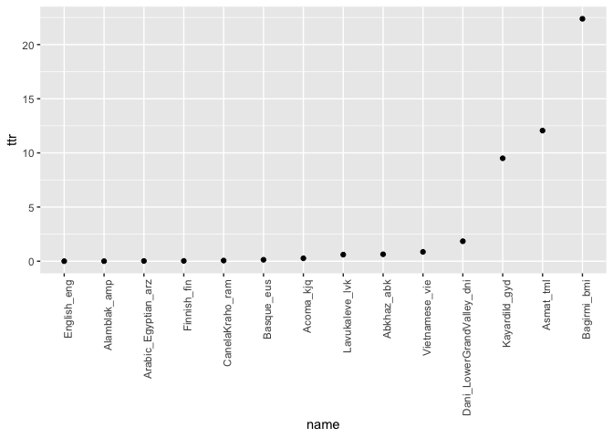

Grapheme TTR in 100LC
================
Steven Moran
25 May, 2020

Load each grapheme orthography profile (OP) from disk, generate TTRs, and write to a table.

``` r
# Create results data frame
header <- c("name", "types", "tokens", "ttr")
results <- as.data.frame(matrix(,0,length(header)))
names(results) <- header

# Loop over the OPs
fils <- list.files("../graphemes/orthography_profiles", pattern="csv$", full.names = TRUE, recursive = TRUE)

# Test:
# file <- fils[1]

for (file in fils) {
  # Get language name from file path
  s <- unlist(strsplit(file, "/"))
  filename <- tail(s, n=1)
  filename <- str_remove(filename, ".csv")
  
  # Read the OP
  df <- read.csv(file=file)

  # Get ttr
  tokens <- sum(df$Frequency)
  types <- length(unique(df$Grapheme))
  ttr <- (types / tokens) * 100
  
  # Add to results data frame
  result <- c(filename, types, tokens, ttr)
  # results <- rbind(results, result)
  results[nrow(results) + 1,] <- result
}

# Clean up
results$types <- as.integer(results$types)
results$tokens <- as.integer(results$tokens)
results$ttr <- as.numeric(results$ttr)
```

``` r
results %>% kable()
```

| name                        |  types|   tokens|         ttr|
|:----------------------------|------:|--------:|-----------:|
| Abkhaz\_abk                 |     64|    10003|   0.6398081|
| Acoma\_kjq                  |     43|    15893|   0.2705594|
| Alamblak\_amp               |     66|  1290455|   0.0051145|
| Arabic\_Egyptian\_arz       |    426|  1961436|   0.0217188|
| Asmat\_tml                  |     24|      199|  12.0603015|
| Bagirmi\_bmi                |     47|      210|  22.3809524|
| Basque\_eus                 |     71|    53270|   0.1332833|
| CanelaKraho\_ram            |     79|   130177|   0.0606866|
| Dani\_LowerGrandValley\_dni |     33|     1789|   1.8446059|
| English\_eng                |     78|  3125326|   0.0024957|
| Finnish\_fin                |     81|   278739|   0.0290594|
| Kayardild\_gyd              |     21|      221|   9.5022624|
| Lavukaleve\_lvk             |     46|     7575|   0.6072607|
| Vietnamese\_vie             |    134|    15543|   0.8621244|

Write the results to CSV.

``` r
write.csv(results, file="graphemes_ttr.csv", row.names=FALSE)
```

Plot the TTR for graphemes.

``` r
library(ggplot2)
p <- results
p$name <- factor(p$name, levels = p$name[order(p$ttr)])
qplot(name, ttr, data=p) +
  theme(axis.text.x = element_text(angle = 90, hjust = 1))
```


