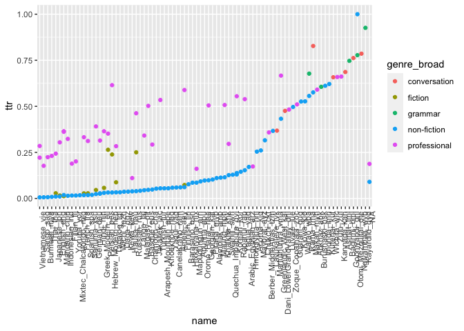
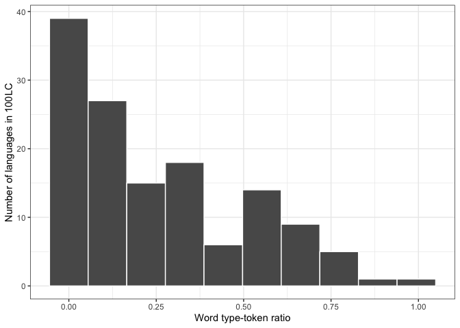

Visualize word and graphemes TTR for 100 LC corpora
================
Steven Moran
29 October, 2020

# Words

Load the results from `get_word_ttr.Rmd`.

    df <- read_csv('word_ttr.csv')

    ## 
    ## ── Column specification ────────────────────────────────────────────────────────
    ## cols(
    ##   name = col_character(),
    ##   genre_broad = col_character(),
    ##   types = col_double(),
    ##   tokens = col_double(),
    ##   ttr = col_double()
    ## )

Plot the languages and their genres by their TTR ratios.

    p <- tidyr::unite(df, corpus, c(name, genre_broad))
    p$corpus <- factor(p$corpus, levels = unique(p$corpus[order(df$ttr)]))
    qplot(corpus, ttr, data=p) +
      theme(axis.text.x = element_text(angle = 90, hjust = 1))

<!-- -->

Here’s the same plot with `ggplot`.

    ggplot(p, aes(x=corpus, y=ttr)) + 
       geom_point() + 
       theme(axis.text.x = element_text(angle = 90, hjust = 1))

<!-- -->

Here’s a plot grouped by genre by color.

    p <- df
    p$name <- factor(p$name, levels = unique(p$name[order(df$ttr)]))

    ggplot(p, aes(x=name, y=ttr, color=genre_broad, group=genre_broad)) + 
       geom_point() + 
       theme(axis.text.x = element_text(angle = 90, hjust = 1))

<!-- -->

    p <- df
    p$name <- factor(p$name, levels = unique(p$name[order(df$ttr)]))

    ggplot(p, aes(x=ttr, y=name, color=genre_broad, group=genre_broad)) + 
       geom_point() +
       theme_bw()

<!-- -->

These are all pretty horrible. Tanja [suggested for the
plots](https://github.com/uzling/100LC/pull/193):

> > > I think we should not aim to have all languages on any plot axis.
> > > So, for plotting the counts and TTRs, I suggest histograms (how
> > > many languages/corpora we have for each TTR value). For this, it
> > > might be useful to bin TTRs (e.g. divide the range of its values
> > > into 20 bins). Then we still need to think a little how to show
> > > the variation across genres, which seems quite big. We could have,
> > > for instance, different colours for histogram bars for “meant TTR
> > > per language”, “only fiction”, “only professional”, etc.

> > > It might be a good idea to have a separate plot for each category
> > > as it might get crowded again if we have 20x5 bars. But lets still
> > > think about this.

Here’s all the languages in a historgram.

    ggplot(df, aes(x=ttr)) + 
      geom_histogram(bins=10, col="white") +
      labs(x="Word type-token ratio", y="Number of languages in 100LC") +
      theme_bw()

<!-- -->

Here they are divided by genre.

    ggplot(df, aes(x=ttr, fill=genre_broad)) + 
      geom_histogram(bins=10, col="white", position = 'identity') +
      labs(x="Word type-token ratio", y="Number of languages in 100LC", fill="Genre") +
      theme_bw() +
      scale_fill_brewer(palette = "Dark2")

<!-- -->

# Graphemes

Load the pre-compiled grapheme ttr data.

    df <- read_csv('grapheme_ttr.csv')

    ## 
    ## ── Column specification ────────────────────────────────────────────────────────
    ## cols(
    ##   name = col_character(),
    ##   genre_broad = col_character(),
    ##   types = col_double(),
    ##   tokens = col_double(),
    ##   ttr = col_double()
    ## )

Plot the TTR for graphemes.

    p <- df
    p <- tidyr::unite(df, corpus, c(name, genre_broad))
    p$name <- factor(p$corpus, levels = unique(p$corpus[order(df$ttr)]))

    qplot(corpus, ttr, data=p) +
      theme(axis.text.x = element_text(angle = 90, hjust = 1))

    ## Warning: Removed 2 rows containing missing values (geom_point).

<!-- -->
