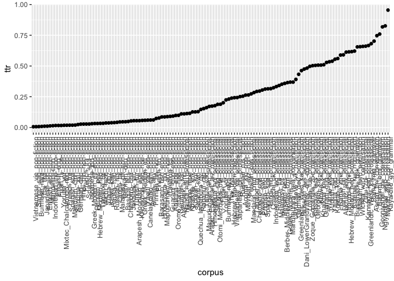
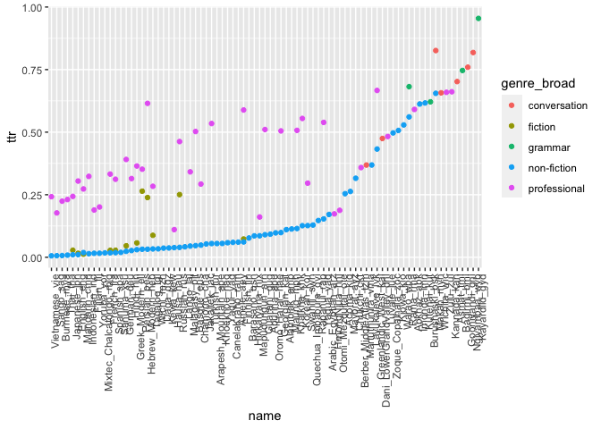
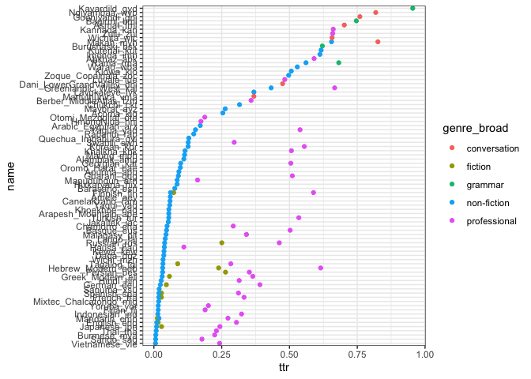

Visualize word TTR for 100 LC corpora
================
Steven Moran
23 August, 2020

Load the results from `get_word_ttr.Rmd`.

    df <- read_csv('word_ttr.csv')

    ## Parsed with column specification:
    ## cols(
    ##   name = col_character(),
    ##   genre_broad = col_character(),
    ##   types = col_double(),
    ##   tokens = col_double(),
    ##   ttr = col_double()
    ## )

Plot the languages and their genres by their TTR ratios.

    p <- tidyr::unite(df, corpus, c(name, genre_broad))
    p$corpus <- factor(p$corpus, levels = unique(p$corpus[order(df$ttr)]))
    qplot(corpus, ttr, data=p) +
      theme(axis.text.x = element_text(angle = 90, hjust = 1))

<!-- -->

Here’s the same plot with `ggplot`.

    ggplot(p, aes(x=corpus, y=ttr)) + 
       geom_point() + 
       theme(axis.text.x = element_text(angle = 90, hjust = 1))

<!-- -->

Here’s a plot grouped by genre by color.

    p <- df
    p$name <- factor(p$name, levels = unique(p$name[order(df$ttr)]))

    ggplot(p, aes(x=name, y=ttr, color=genre_broad, group=genre_broad)) + 
       geom_point() + 
       theme(axis.text.x = element_text(angle = 90, hjust = 1))

<!-- -->

    p <- df
    p$name <- factor(p$name, levels = unique(p$name[order(df$ttr)]))

    ggplot(p, aes(x=ttr, y=name, color=genre_broad, group=genre_broad)) + 
       geom_point() +
       theme_bw()

<!-- -->
