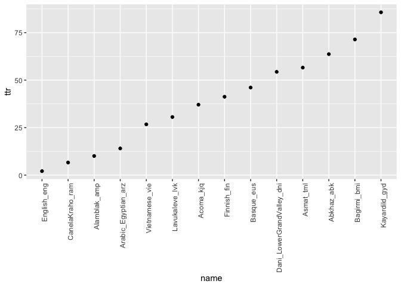

Word TTR in 100LC
================
Steven Moran
25 May, 2020

Generate word type-token ratios for the 100LC corpus data.

Query the database and return a dataframe.

``` r
db.file <- '../../Database/words.sqlite3' # Test data
# db.file <- '../../Database/full.sqlite3'

runsql <- function(sql, dbname=db.file){
  require(RSQLite)
  driver <- dbDriver("SQLite")
  connect <- dbConnect(driver, dbname=dbname);
  closeup <- function(){
    sqliteCloseConnection(connect)
    sqliteCloseDriver(driver)
  }
  dd <- tryCatch(dbGetQuery(connect, sql), finally=closeup)
  return(dd)
}
```

Get the word token counts.

``` r
tokens <- runsql('
SELECT name, writing_system, count(*) 
FROM v_words 
GROUP BY name, writing_system
')

tokens <- tokens %>% rename(tokens = `count(*)`)
```

Get word type counts.

``` r
types <- runsql('
SELECT name, writing_system, word_text, count(*) 
FROM v_words 
GROUP BY name, writing_system, word_text
')
```

Make sure the sum of counts is correct from SQL.

``` r
test <- types %>% filter(name=='Abkhaz_abk') %>% filter(writing_system=='Cyrl') %>% select('count(*)')
sum(test$`count(*)`)
```

    ## [1] 1325

Get the type counts.

``` r
types <- types %>% group_by(name, writing_system) %>% summarize(types=n())
```

Join the type and token counts into a single data frame.

``` r
ttr <- left_join(types, tokens)
```

    ## Joining, by = c("name", "writing_system")

Calculate the type-token ratio: (number of types/number of tokens) \* 100.

``` r
ttr$ttr <- (ttr$types / ttr$tokens) * 100
```

A table if TTR values:

``` r
library(knitr)
ttr %>% kable()
```

| name                        | writing\_system |  types|  tokens|        ttr|
|:----------------------------|:----------------|------:|-------:|----------:|
| Abkhaz\_abk                 | Cyrl            |    844|    1325|  63.698113|
| Acoma\_kjq                  | Latn            |    902|    2433|  37.073572|
| Alamblak\_amp               | Latn            |  27044|  268933|  10.056036|
| Arabic\_Egyptian\_arz       | Arab            |  74274|  528641|  14.049989|
| Asmat\_tml                  | Latn            |     30|      53|  56.603774|
| Bagirmi\_bmi                | Latn            |     50|      70|  71.428571|
| Basque\_eus                 | Latn            |   4072|    8832|  46.105072|
| CanelaKraho\_ram            | Latn            |   2666|   40181|   6.634977|
| Dani\_LowerGrandValley\_dni | Latn            |    162|     298|  54.362416|
| English\_eng                | Latn            |  17587|  842657|   2.087089|
| Finnish\_fin                | Latn            |  16126|   39088|  41.255628|
| Kayardild\_gyd              | Latn            |     24|      28|  85.714286|
| Lavukaleve\_lvk             | Latn            |    645|    2109|  30.583215|
| Vietnamese\_vie             | Latn            |   1215|    4545|  26.732673|

Plot the languages by their TTR ratios.

``` r
library(ggplot2)
p <- ttr
p$name <- factor(p$name, levels = p$name[order(ttr$ttr)])
qplot(name, ttr, data=p) +
  theme(axis.text.x = element_text(angle = 90, hjust = 1))
```



Write the table to CSV.

``` r
write.csv(ttr, file="words_ttr.csv", row.names=FALSE)
```
