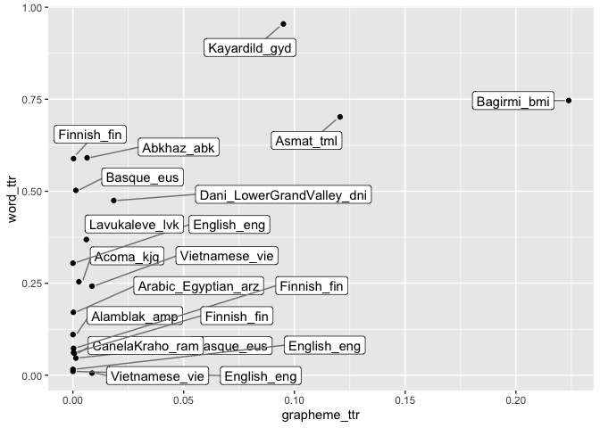

Words vs graphemes type-token ratios in TeDDi corpora
================
Steven Moran

31 October, 2020

    words_ttr <- read_csv('word_ttr.csv')
    words_ttr <- tidyr::unite(words_ttr, name, c(name, genre_broad))
    w_cut <- words_ttr %>% select(name, ttr) %>% rename(word_ttr = ttr)

    graphemes_ttr <- read.csv('grapheme_ttr.csv')
    graphemes_ttr <- tidyr::unite(graphemes_ttr, name, c(name, genre_broad))
    g_cut <- graphemes_ttr %>% select(name, ttr) %>% rename(grapheme_ttr = ttr)

    ttr <- left_join(w_cut, g_cut)

    ## Joining, by = "name"

    ggplot(ttr, aes(x = grapheme_ttr, y = word_ttr, label = name)) +
      geom_point() +
      geom_label_repel(aes(label = name),
                      box.padding   = 0.35,
                      point.padding = 0.5,
                      segment.color = 'grey50')

    ## Warning: Removed 4 rows containing missing values (geom_point).

    ## Warning: Removed 4 rows containing missing values (geom_label_repel).

<!-- -->
