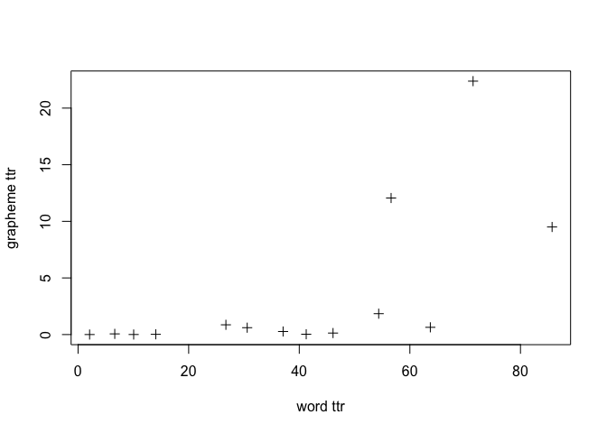
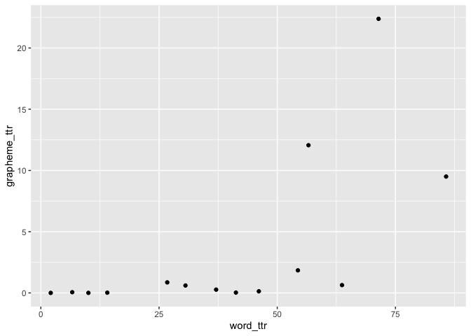

Grapheme TTR in 100LC
================
Steven Moran
25 May, 2020

``` r
words.ttr <- read.csv('words_ttr.csv')
w.cut <- words.ttr %>% select(name, ttr) %>% rename(word_ttr=ttr)
graphemes.ttr <- read.csv('graphemes_ttr.csv')
g.cut <- graphemes.ttr %>% select(name, ttr) %>% rename(grapheme_ttr=ttr)
```

``` r
ttr <- left_join(w.cut, g.cut)
```

    ## Joining, by = "name"

``` r
plot(ttr$word_ttr, ttr$grapheme_ttr, xlab="word ttr", ylab="grapheme ttr", pch=3)
```



``` r
library(ggplot2)
qplot(word_ttr, grapheme_ttr, data=ttr)
```


