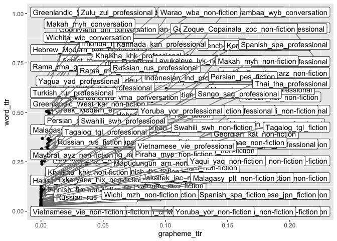

Words vs graphemes TTR in 100LC
================
Steven Moran
23 August, 2020

    words.ttr <- read.csv('word_ttr.csv')
    w.cut <- words.ttr %>% select(name, ttr) %>% rename(word_ttr=ttr)
    graphemes.ttr <- read.csv('graphemes_ttr.csv')
    g.cut <- graphemes.ttr %>% select(name, ttr) %>% rename(grapheme_ttr=ttr)

    ttr <- left_join(w.cut, g.cut)

    ## Joining, by = "name"

    library(ggplot2)
    library(ggrepel)
    ggplot(ttr, aes(x=grapheme_ttr, y=word_ttr, label=name)) + 
      geom_point() +
      geom_label_repel(aes(label = name),
                      box.padding   = 0.35, 
                      point.padding = 0.5,
                      segment.color = 'grey50')

    ## Warning: Removed 108 rows containing missing values (geom_point).

    ## Warning: Removed 108 rows containing missing values (geom_label_repel).

<!-- -->
